## Slide 36: Real-Time and Batch Sync Capabilities

### **Dual-Mode Data Synchronization Architecture**


**🎤 Sync Architecture Overview**

The Wildfire Data Clearing House supports dual mode synchronization... real time streaming for critical alerts and live dashboards... and batch sync for analytics and reporting.

This hybrid approach optimizes for both latency and resource efficiency.

The architecture has four layers working together.

Real Time Sync uses Kafka C D C for Change Data Capture... Kafka Consumer for continuous polling... Stream Processor using Kafka Streams... and Real Time Validator for schema checking.

Batch Sync uses Airflow Scheduler for cron based execution... Batch Extractor for S Q L queries... Incremental Load with watermark tracking... and Full Refresh for complete replacement.

Sync Orchestration includes Sync Controller for hybrid mode selection... Conflict Resolver with last write wins strategy... Checkpoint Manager for offset tracking... and Metric Collector for lag monitoring.

Target Systems receive the synchronized data... the Clearing House Database on PostgreSQL... Search Index on Elasticsearch... Analytics Database on ClickHouse... and Cache Layer on Redis.

---

### **Sync Mode Comparison**

| Feature | Real-Time Sync | Batch Sync |
|---------|----------------|------------|
| **Latency** | Less than one second | Fifteen minutes to twenty four hours |
| **Data Volume** | Continuous stream | Bulk transfer |
| **Resource Usage** | Moderate CPU with low memory | High CPU and memory spike |
| **Use Case** | Critical alerts and live dashboards | Analytics, reporting, and archival |
| **Technology** | Kafka C D C and Streams | Airflow D A Gs and S Q L |
| **Failure Recovery** | Kafka offset replay | Checkpoint based retry |
| **Data Freshness** | Always current | Scheduled intervals |
| **Network Impact** | Steady bandwidth | Burst bandwidth |

**🎤 Comparing Sync Modes**

The sync mode comparison shows the tradeoffs between real time and batch approaches.

Real time sync achieves sub second latency with continuous streaming... using Kafka C D C and Streams... ideal for critical alerts and live dashboards that require immediate updates.

Batch sync has fifteen minute to twenty four hour latency with bulk transfer... using Airflow D A Gs and S Q L... ideal for analytics and reporting where scheduled updates are acceptable.

Real time uses moderate C P U with low memory for steady processing.

Batch sync creates high C P U and memory spikes during bulk operations.

For failure recovery... real time uses Kafka offset replay to resume from exactly where it left off.

Batch sync uses checkpoint based retry with watermark tracking.

Network impact differs significantly... real time maintains steady bandwidth usage... while batch sync creates burst bandwidth during scheduled runs.

---

### **Real-Time CDC Performance**

| Metric | Value | Target |
|--------|-------|--------|
| **CDC Latency** | Zero point three seconds at p ninety five | Less than one second |
| **Throughput** | Fifty thousand changes per second | Greater than twenty thousand |
| **Replication Lag** | Zero point three seconds at p ninety five | Less than one second |
| **Consumer Processing Rate** | One hundred twenty five thousand events per second | Greater than one hundred thousand |
| **End-to-End Latency** | Three hundred forty milliseconds | Less than one second |
| **Uptime** | Ninety nine point nine seven percent | Greater than ninety nine point nine percent |

**🎤 Real-Time Performance Metrics**

Real time sync implementation uses PostgreSQL logical replication with Debezium connector.

When a fire detection record is inserted into the HOT tier... the database publishes change event to Kafka topic wildfire dot public dot fire detections hot.

The event includes operation type... create, update, or delete... before and after values... and source metadata.

C D C latency is under one second from commit to Kafka publish... with throughput of fifty thousand changes per second.

The Kafka Consumer subscribes to C D C topics and syncs events to clearing house database.

For create operations... insert to clearing house.

For update operations... update in clearing house.

For delete operations... delete from clearing house.

After successful sync... manually commit Kafka offset for exactly once semantics.

Processing rate reaches one hundred twenty five thousand events per second with end to end latency of three hundred forty milliseconds.

Consumer lag stays at zero... meaning the system is always caught up with no backlog.

Uptime is ninety nine point nine seven percent... exceeding our ninety nine point nine percent target.

---

### **Batch Sync Performance**

| Sync Mode | Schedule | Records Per Run | Duration | Data Freshness | Success Rate |
|-----------|----------|-----------------|----------|----------------|--------------|
| **Incremental Load** | Every fifteen minutes | Twelve thousand four hundred eighty seven | Forty two point seven seconds | Fifteen minutes max lag | Ninety nine point nine four percent |
| **Full Refresh** | Daily at two A M U T C | Twenty eight point seven million | Thirty point eight minutes | Twenty four hours | Ninety nine point eight seven percent |

**🎤 Batch Sync Statistics**

Batch sync implementation supports two modes.

Incremental load uses watermark based tracking.

Get last sync watermark from checkpoint table... example October twenty third at noon.

Extract new records where updated at is greater than last watermark.

Transform and validate each record.

Upsert to clearing house with conflict handling.

Update watermark checkpoint to maximum updated at timestamp.

This runs every fifteen minutes with average duration of forty two point seven seconds syncing twelve thousand four hundred eighty seven records.

Full refresh mode performs complete replacement using atomic swap pattern.

Extract entire dataset from WARM tier Parquet... example twenty eight point seven million records.

Create new temp table.

Load data to temp table.

Swap table names atomically... rename clearing house to old... rename temp to clearing house... drop old table.

This achieves zero downtime.

Rebuild indexes and update statistics for query planner.

Full refresh runs daily at two A M U T C during low traffic period... completing in thirty point eight minutes.

---

### **Conflict Resolution Statistics**

| Scenario | Count Per Day | Percentage | Resolution |
|----------|---------------|------------|------------|
| **No Conflict** | Four hundred eighty six thousand three hundred forty two | Ninety nine point nine percent | Direct insert or update |
| **Same Timestamp** | Four hundred twenty one | Zero point zero eight six percent | Skip update with no change |
| **Older Timestamp** | Eighty nine | Zero point zero one eight percent | Reject update and keep newer |
| **Total** | Four hundred eighty six thousand eight hundred fifty two | One hundred percent | All handled |

**🎤 Handling Conflicts**

Conflict resolution uses last write wins strategy.

When upserting records... the ON CONFLICT clause compares timestamps.

Only update if incoming record timestamp is newer than existing record.

This prevents stale data from overwriting fresh data.

Conflict detection metrics show ninety nine point nine percent no conflict... meaning most records insert or update cleanly.

Zero point zero eight six percent have same timestamp and are skipped with no change.

Zero point zero one eight percent have older timestamp and are rejected to keep the newer data.

All four hundred eighty six thousand eight hundred fifty two daily operations are handled automatically.

---

### **Checkpoint Management**

**Checkpoint Table Structure**

| Column | Description | Example |
|--------|-------------|---------|
| **source_table** | Name of source dataset | fire_detections_hot |
| **last_watermark** | Timestamp of last sync | October twenty third at two thirty P M |
| **last_sync_at** | When sync completed | October twenty third at two thirty two P M |
| **records_synced** | Count of records processed | Twelve thousand four hundred eighty seven |
| **sync_duration_seconds** | Time taken to sync | Forty two point seven |
| **sync_mode** | Type of sync performed | incremental |

**🎤 Checkpoint Recovery**

Checkpoint management tracks sync progress in checkpoint table.

Each source table has last watermark timestamp... last sync timestamp... records synced count... sync duration... and sync mode.

After failure... recovery reads last checkpoint and resumes from watermark.

For example... if system crashed at two thirty P M... checkpoint shows last watermark at two fifteen P M.

Calculate missed records since checkpoint... example three thousand four hundred twenty one records.

Resume incremental sync from checkpoint watermark.

This ensures no data is lost during outages... and all missed records are recovered on restart.

---

### **Sync Monitoring Dashboard**

**Grafana Panels**

1. **CDC Replication Lag** - Real time graph of seconds behind source
2. **Consumer Lag** - Kafka consumer offset lag per topic
3. **Batch Sync Status** - Last run time, duration, and records synced
4. **Conflict Resolution** - Daily count of conflicts by type
5. **Checkpoint Watermarks** - Timeline of sync progress per table
6. **Sync Throughput** - Records per second for real time and batch

**Alerting Rules**

- **CDC Lag greater than five seconds** - Page on call engineer
- **Consumer Lag greater than one thousand messages** - Investigate bottleneck
- **Batch Sync Failed** - Retry automatically and alert after three failures
- **Checkpoint Not Updated for over one hour** - Check Airflow scheduler

**🎤 Monitoring and Alerts**

The Sync Monitoring Dashboard visualizes six key panels in Grafana.

C D C Replication Lag shows real time graph of seconds behind source.

Consumer Lag displays Kafka consumer offset lag per topic.

Batch Sync Status shows last run time... duration... and records synced.

Conflict Resolution counts conflicts by type.

Checkpoint Watermarks show timeline of sync progress per table.

And Sync Throughput graphs records per second for real time and batch modes.

Alerting rules ensure reliability.

C D C lag greater than five seconds pages on call engineer.

Consumer lag greater than one thousand messages triggers investigation.

Batch sync failures retry automatically... alerting after three failures.

And checkpoint not updated for over one hour triggers Airflow scheduler check.

This comprehensive dual mode sync keeps the clearing house current with sub second latency.

---

## Slide 37: Data Quality Assurance Framework

### **Comprehensive Quality Validation and Monitoring**

```mermaid
graph TB
    subgraph "Data Quality Framework"
        subgraph "Quality Service (Port 8004)"
            QUALITY_ENGINE[Quality Engine<br/>25+ Validation Rules]
            RULE_EXECUTOR[Rule Executor<br/>Parallel Validation]
            SCORE_CALCULATOR[Score Calculator<br/>Weighted Average]
            ANOMALY_DETECTOR[Anomaly Detector<br/>ML-based]
        end

        subgraph "Validation Rules (6 Categories)"
            COMPLETENESS[Completeness Checks<br/>Non-null Required Fields]
            VALIDITY[Validity Checks<br/>Range, Format, Type]
            CONSISTENCY[Consistency Checks<br/>Cross-field Logic]
            ACCURACY[Accuracy Checks<br/>Reference Data]
            TIMELINESS[Timeliness Checks<br/>Timestamp Freshness]
            UNIQUENESS[Uniqueness Checks<br/>Duplicate Detection]
        end

        subgraph "Quality Dimensions"
            DIM_COMPLETE[Completeness Score<br/>0.0-1.0]
            DIM_VALID[Validity Score<br/>0.0-1.0]
            DIM_CONSISTENT[Consistency Score<br/>0.0-1.0]
            DIM_ACCURATE[Accuracy Score<br/>0.0-1.0]
            DIM_TIMELY[Timeliness Score<br/>0.0-1.0]
            DIM_UNIQUE[Uniqueness Score<br/>0.0-1.0]
        end

        subgraph "Quality Actions"
            ACCEPT[Accept<br/>Score ≥ 0.95]
            WARN[Warn<br/>0.80 ≤ Score < 0.95]
            QUARANTINE[Quarantine<br/>0.60 ≤ Score < 0.80]
            REJECT[Reject<br/>Score < 0.60]
        end
    end

    subgraph "Data Sources"
        INGESTION[Data Ingestion<br/>Port 8003]
        KAFKA_STREAM[Kafka Stream<br/>Real-Time]
        BATCH_LOAD[Batch Load<br/>Airflow]
    end

    subgraph "Quality Outputs"
        QUALITY_DB[(Quality Metrics DB<br/>PostgreSQL)]
        QUALITY_REPORT[Quality Reports<br/>Daily/Weekly]
        ALERT_SERVICE[Alert Service<br/>Threshold Violations]
        LINEAGE_UPDATE[Lineage Update<br/>Quality Provenance]
    end

    INGESTION --> QUALITY_ENGINE
    KAFKA_STREAM --> QUALITY_ENGINE
    BATCH_LOAD --> QUALITY_ENGINE

    QUALITY_ENGINE --> RULE_EXECUTOR
    RULE_EXECUTOR --> SCORE_CALCULATOR
    SCORE_CALCULATOR --> ANOMALY_DETECTOR

    RULE_EXECUTOR --> COMPLETENESS
    RULE_EXECUTOR --> VALIDITY
    RULE_EXECUTOR --> CONSISTENCY
    RULE_EXECUTOR --> ACCURACY
    RULE_EXECUTOR --> TIMELINESS
    RULE_EXECUTOR --> UNIQUENESS

    COMPLETENESS --> DIM_COMPLETE
    VALIDITY --> DIM_VALID
    CONSISTENCY --> DIM_CONSISTENT
    ACCURACY --> DIM_ACCURATE
    TIMELINESS --> DIM_TIMELY
    UNIQUENESS --> DIM_UNIQUE

    DIM_COMPLETE --> SCORE_CALCULATOR
    DIM_VALID --> SCORE_CALCULATOR
    DIM_CONSISTENT --> SCORE_CALCULATOR
    DIM_ACCURATE --> SCORE_CALCULATOR
    DIM_TIMELY --> SCORE_CALCULATOR
    DIM_UNIQUE --> SCORE_CALCULATOR

    SCORE_CALCULATOR --> ACCEPT
    SCORE_CALCULATOR --> WARN
    SCORE_CALCULATOR --> QUARANTINE
    SCORE_CALCULATOR --> REJECT

    ACCEPT --> QUALITY_DB
    WARN --> QUALITY_DB
    QUARANTINE --> QUALITY_DB
    REJECT --> QUALITY_DB

    QUALITY_DB --> QUALITY_REPORT
    QUALITY_DB --> ALERT_SERVICE
    QUALITY_DB --> LINEAGE_UPDATE

    style QUALITY_ENGINE fill:#4ecdc4,stroke:#333,stroke-width:3px,color:#000
    style SCORE_CALCULATOR fill:#95e1d3,stroke:#333,stroke-width:2px,color:#000
    style ACCEPT fill:#2ecc71,stroke:#333,stroke-width:2px,color:#000
    style QUARANTINE fill:#f39c12,stroke:#333,stroke-width:2px,color:#000
    style REJECT fill:#e74c3c,stroke:#333,stroke-width:2px,color:#000
```



**🎤 Quality Framework Architecture**

Data quality is the foundation of trustworthy analytics.

Our Data Quality Service on port eight zero zero four implements twenty five plus validation rules across six categories... ensuring every record meets production standards before reaching the clearing house.

The Data Quality Framework has four layers working together.

The Quality Service includes Quality Engine with twenty five plus validation rules... Rule Executor for parallel validation... Score Calculator using weighted average... and Anomaly Detector with M L based detection.

Validation Rules span six categories.

Completeness checks for non null required fields.

Validity checks for range... format... and type.

Consistency checks for cross field logic.

Accuracy checks against reference data.

Timeliness checks for timestamp freshness.

And Uniqueness checks for duplicate detection.

Quality dimensions produce six scores from zero to one.

Completeness Score measures field population.

Validity Score measures data correctness.

Consistency Score measures logical coherence.

Accuracy Score measures reference alignment.

Timeliness Score measures data freshness.

And Uniqueness Score measures duplicate rate.

These six dimension scores combine with weighted average to produce overall quality score.

Quality actions depend on score thresholds.

Score greater than or equal to zero point nine five triggers ACCEPT... high quality passed to production... record visible in clearing house.

Score between zero point eight and zero point nine four triggers WARN... acceptable with warnings... record visible with quality flag warn.

Score between zero point six and zero point eight triggers QUARANTINE... moderate issues requiring manual review... record in quarantine table not visible to users.

Score below zero point six triggers REJECT... critical issues making data unusable... record sent to Dead Letter Queue for retry or discard.

---

### **25+ Validation Rules**

**Completeness Checks - Six Rules**

| Rule ID | Rule Name | Severity |
|---------|-----------|----------|
| **C zero one** | Required Fields Non Null | CRITICAL |
| **C zero two** | Field Completeness Percentage | MEDIUM |
| **C zero three** | Empty String Detection | MEDIUM |
| **C zero four** | Nested Object Completeness | LOW |
| **C zero five** | Array Length Validation | LOW |
| **C zero six** | Optional Field Population Rate | INFO |

**Validity Checks - Eight Rules**

| Rule ID | Rule Name | Severity |
|---------|-----------|----------|
| **V zero one** | Latitude Range negative ninety to positive ninety | CRITICAL |
| **V zero two** | Longitude Range negative one eighty to positive one eighty | CRITICAL |
| **V zero three** | Brightness Temperature Range two seventy three to five hundred Kelvin | HIGH |
| **V zero four** | Timestamp Format ISO eight six zero one or Unix epoch | CRITICAL |
| **V zero five** | Enum Value Validation | MEDIUM |
| **V zero six** | Email Format R F C five three two two | MEDIUM |
| **V zero seven** | URL Format valid H T T P or H T T P S | LOW |
| **V zero eight** | Phone Number Format E one six four international | LOW |

**Consistency Checks - Four Rules**

| Rule ID | Rule Name | Severity |
|---------|-----------|----------|
| **C O zero one** | Cross Field Logic fire detected means brightness greater than three ten Kelvin | HIGH |
| **C O zero two** | Temporal Consistency created at less than or equal to updated at | MEDIUM |
| **C O zero three** | Geographic Consistency location within expected region | MEDIUM |
| **C O zero four** | Unit Consistency all temperatures in same unit | LOW |

**Accuracy Checks - Three Rules**

| Rule ID | Rule Name | Severity |
|---------|-----------|----------|
| **A zero one** | Reference Data Lookup county name exists in reference table | HIGH |
| **A zero two** | Geocoding Accuracy lat lon matches county boundary | MEDIUM |
| **A zero three** | Satellite ID Validation satellite name in known list | MEDIUM |

**Timeliness Checks - Two Rules**

| Rule ID | Rule Name | Severity |
|---------|-----------|----------|
| **T zero one** | Timestamp Freshness data not older than seven days | HIGH |
| **T zero two** | Future Timestamp Detection timestamp not in future | CRITICAL |

**Uniqueness Checks - Two Rules**

| Rule ID | Rule Name | Severity |
|---------|-----------|----------|
| **U zero one** | Primary Key Uniqueness detection ID is unique | CRITICAL |
| **U zero two** | Duplicate Record Detection exact duplicate records flagged | MEDIUM |

**🎤 Validation Rule Categories**

Let me walk through the validation rules in detail.

Completeness checks include six rules.

Rule C zero one validates required fields are non null... critical fields like latitude... longitude... brightness... timestamp must be present.

Rule C zero two calculates field completeness percentage.

Rule C zero three detects empty strings or whitespace only values.

These completeness checks ensure data is sufficiently populated for analysis.

Validity checks include eight rules.

Rule V zero one validates latitude range negative ninety to positive ninety.

Rule V zero two validates longitude range negative one eighty to positive one eighty.

Rule V zero three validates brightness temperature range from absolute zero at two seventy three point one five Kelvin to maximum fire temperature at five hundred Kelvin.

Rule V zero four validates timestamp format as ISO eight six zero one or Unix epoch.

Rule V zero five validates enum values like confidence must be LOW... NOMINAL... or HIGH.

These validity checks ensure data values are physically and logically possible.

Consistency checks include four rules.

Rule C O zero one validates cross field logic... if fire detected then brightness must be greater than three hundred ten Kelvin.

Rule C O zero two validates temporal consistency... created at must be less than or equal to updated at.

Rule C O zero three validates geographic consistency... location within expected region.

Rule C O zero four validates unit consistency... all temperatures in same unit.

Accuracy checks include three rules.

Rule A zero one validates reference data lookup... county name must exist in reference table.

Rule A zero two validates geocoding accuracy... latitude longitude must match claimed county boundary using PostGIS reverse geocoding.

Rule A zero three validates satellite I D... satellite name must be in known list like VIIRS NOAA twenty... MODIS Aqua.

Timeliness checks include two rules.

Rule T zero one validates timestamp freshness... data not older than seven days for real time use cases.

Rule T zero two detects future timestamps... acquisition date cannot be in future.

Uniqueness checks include two rules.

Rule U zero one validates primary key uniqueness... detection I D must be unique.

Rule U zero two detects duplicate records using S H A two fifty six content hash stored in Redis with fifteen minute T T L.

---

### **Quality Score Calculation**

**Dimension Weights**

| Dimension | Weight | Rationale |
|-----------|--------|-----------|
| **Completeness** | Twenty five percent | Critical for all datasets |
| **Validity** | Twenty five percent | Critical for all datasets |
| **Consistency** | Fifteen percent | Important but less critical |
| **Accuracy** | Fifteen percent | Important but less critical |
| **Timeliness** | Ten percent | Depends on use case |
| **Uniqueness** | Ten percent | Depends on use case |

**Example Calculation**

| Dimension | Score | Weight | Weighted Score |
|-----------|-------|--------|----------------|
| Completeness | One point zero | Twenty five percent | Zero point two five |
| Validity | Zero point eight seven five | Twenty five percent | Zero point two one nine |
| Consistency | Zero point seven five | Fifteen percent | Zero point one one three |
| Accuracy | One point zero | Fifteen percent | Zero point one five |
| Timeliness | Zero point eight | Ten percent | Zero point zero eight |
| Uniqueness | One point zero | Ten percent | Zero point one |
| **Overall** | - | - | **Zero point nine one two** |

**🎤 Calculating Quality Scores**

Quality score calculation uses weighted average across six dimensions.

Completeness weight is twenty five percent... critical for all datasets.

Validity weight is twenty five percent... critical for all datasets.

Consistency weight is fifteen percent... important but less critical.

Accuracy weight is fifteen percent.

Timeliness weight is ten percent... depends on use case.

Uniqueness weight is ten percent.

The weighted sum produces overall quality score from zero to one.

For example... record with completeness one point oh... validity zero point eight seven five... consistency zero point seven five... accuracy one point oh... timeliness zero point eight... and uniqueness one point oh... calculates to overall score of zero point nine one two... which falls in WARN threshold.

---

### **Quality Statistics**

| Metric | Value | Calculation Period |
|--------|-------|-------------------|
| **Total Records Validated** | Four hundred eighty seven million two hundred thirty four thousand eight hundred ninety one | Last thirty days |
| **Average Quality Score** | Zero point nine four seven | Overall |
| **ACCEPT Rate** | Ninety four point two percent or four hundred fifty nine million records | score greater than or equal to zero point nine five |
| **WARN Rate** | Four point eight percent or twenty three point four million records | zero point eight to zero point nine five |
| **QUARANTINE Rate** | Zero point eight percent or three point nine million records | zero point six to zero point eight |
| **REJECT Rate** | Zero point two percent or nine hundred seventy four thousand records | score less than zero point six |
| **Validation Throughput** | One hundred twenty five thousand records per second | Real time |
| **Validation Latency at p ninety five** | Twelve milliseconds | Per record |

**🎤 Production Quality Results**

Quality statistics from production show impressive results.

Four hundred eighty seven million records validated in last thirty days.

Average quality score is zero point nine four seven.

ACCEPT rate is ninety four point two percent... four hundred fifty nine million records with score greater than or equal to zero point nine five.

WARN rate is four point eight percent... twenty three point four million records.

QUARANTINE rate is zero point eight percent... three point nine million records.

REJECT rate is only zero point two percent... nine hundred seventy four thousand records.

Validation throughput reaches one hundred twenty five thousand records per second with twelve millisecond latency at ninety fifth percentile.

---

### **ML Anomaly Detection**

**Detection Methods**

| Method | Purpose | Detection Rate | False Positive Rate |
|--------|---------|----------------|---------------------|
| **Isolation Forest** | Point anomalies like sensor malfunction | Zero point zero four percent | Two point three percent |
| **LSTM Network** | Temporal anomalies like unusual patterns over time | Zero point zero four percent | Two point three percent |
| **Combined** | Maximum of both detectors | One hundred ninety five thousand per day | Ninety seven point seven percent accuracy |

**Common Anomalies Detected**

- Sensor malfunction reporting nine ninety nine point nine Fahrenheit
- Coordinate errors with latitude longitude swapped
- Unusual fire patterns with multiple fires in tight cluster

**🎤 Machine Learning Anomaly Detection**

Anomaly detection uses M L models... Isolation Forest for point anomalies and L S T M for temporal anomalies.

Isolation Forest detects unusual individual records like sensor malfunction reporting nine ninety nine point nine Fahrenheit.

L S T M detects unusual patterns over time like sudden spike in fire detections.

Detection rate is zero point zero four percent... one hundred ninety five thousand anomalies per day.

False positive rate is only two point three percent... meaning ninety seven point seven percent of flagged anomalies are confirmed true anomalies after manual review.

This comprehensive quality assurance framework ensures only trustworthy data reaches the clearing house.

---

## Slide 38: Validation Rules and Anomaly Detection Flow

### **Automated Quality Pipeline with ML-Powered Anomaly Detection**


**🎤 Complete Validation Pipeline**

The validation pipeline is a sophisticated multi stage process that combines rule based validation with M L powered anomaly detection... ensuring only high quality data reaches the clearing house.

Let me walk you through the complete flow.

Every incoming data record starts with Parse and Deserialize... converting Avro... JSON... or Parquet formats into structured objects.

This feeds into Validation Stage One... Schema Compliance... the gatekeeper that performs fast fail for malformed data.

Using Avro schema validation with strict type checking... we validate fifty thousand records per second with zero point five millisecond latency at ninety fifth percentile.

Records that fail schema validation are immediately rejected and sent to Dead Letter Queue.

This catches zero point zero two percent of records... just two hundred per million... preventing expensive business rule validation on garbage data.

Records that pass schema compliance move to Validation Stage Two... Business Rules.

Here we execute twenty five validation rules across six categories in parallel.

Completeness rules run six checks for non null fields and field population.

Validity rules run eight checks for ranges... formats... and types.

Consistency rules run four checks for cross field logic.

Accuracy rules run three checks against reference data.

Timeliness rules run two checks for timestamp freshness.

And Uniqueness rules run two checks for duplicates.

By executing these six rule groups in parallel across six CPU cores... we achieve six point two five times speedup... completing all twenty five rules in just twelve milliseconds instead of seventy five milliseconds sequential.

After parallel rule execution... we aggregate results from all twenty five validation checks and calculate the quality score using weighted average.

Completeness and Validity get twenty five percent weight each... Consistency and Accuracy get fifteen percent each... and Timeliness and Uniqueness get ten percent each.

Next comes M L Anomaly Detection.

Two machine learning models work together to detect unusual patterns.

Isolation Forest detects point anomalies... individual records that are statistically unusual like sensor malfunctions or coordinate errors.

L S T M Network detects temporal anomalies... unusual patterns over time like sudden spike in fire detections or off hours activity.

The anomaly score determines the penalty applied to quality score.

Severe anomaly with score above zero point seven applies twenty percent penalty.

Moderate anomaly with score above zero point five applies ten percent penalty.

Mild anomaly with score above zero point three applies five percent penalty.

Normal records with score below zero point three receive no penalty.

Let me show you an example.

A record with base quality score of zero point nine four seven from business rules... but M L models detect moderate anomaly with score zero point six seven... applies ten percent penalty.

Final score equals zero point nine four seven times zero point nine equals zero point eight five two three... which falls into WARN threshold instead of ACCEPT.

The final quality score determines the action.

Score greater than or equal to zero point nine five triggers ACCEPT... insert to clearing house with success metrics logged.

Score between zero point eight and zero point nine four triggers WARN... insert with quality flag warn and warning metrics logged.

Score between zero point six and zero point eight triggers QUARANTINE... record held for manual review with alert sent to ops team.

Score below zero point six triggers REJECT... record sent to Dead Letter Queue for retry with exponential backoff.

---

### **Validation Performance**

| Stage | Latency at p fifty | Latency at p ninety five | Throughput |
|-------|-------------------|-------------------------|------------|
| **Schema Compliance** | Zero point five milliseconds | One point two milliseconds | Fifty thousand records per second |
| **Business Rules Parallel** | Eight point seven milliseconds | Twelve point three milliseconds | One hundred twenty five thousand records per second |
| **ML Anomaly Detection** | Three point four milliseconds | Seven point eight milliseconds | One hundred twenty five thousand records per second |
| **Total End to End** | Twelve milliseconds | Fifteen milliseconds | One hundred twenty five thousand records per second |

**🎤 Pipeline Performance**

Performance is impressive.

Schema compliance validates at zero point five millisecond latency.

Business rules complete in twelve milliseconds with parallel execution.

M L anomaly detection adds just three point four milliseconds median latency.

Total end to end validation pipeline completes in under fifteen milliseconds at ninety fifth percentile.

This sophisticated validation flow protects the clearing house from bad data while maintaining high throughput.

---

### **Dead Letter Queue Statistics**

| Metric | Value | Notes |
|--------|-------|-------|
| **DLQ Ingestion Rate** | Nine hundred seventy four records per day | Zero point two percent of total records |
| **Retry Success Rate** | Sixty eight point three percent | Recovered after retry |
| **Permanent Failures** | Thirty one point seven percent | Moved to permanent failure after five attempts |
| **Average Retries to Success** | Two point four attempts | Most succeed on second or third try |
| **Max Backoff Time** | Sixteen minutes | After four failed attempts |

**🎤 Retry and Recovery**

The Dead Letter Queue implements intelligent retry logic.

Background process scans D L Q every minute for records ready to retry.

Exponential backoff uses one minute... two minutes... four minutes... eight minutes... sixteen minutes delays.

After five failed attempts... record moves to permanent failure table.

D L Q statistics show sixty eight point three percent retry success rate... meaning most rejected records eventually recover after transient issues are resolved.

Average retries to success is two point four attempts.

---

## Slide 39: Data Profiling and Quality Reports

### **Automated Data Quality Monitoring and Reporting**


**🎤 Profiling System Architecture**

Comprehensive data profiling and reporting provide visibility into data quality trends... enabling proactive quality management instead of reactive firefighting.

Our Data Profiling System generates automated reports daily... weekly... and monthly... with real time alerts for threshold violations.

The Profiling Engine has four components working together.

Profiling Scheduler uses Airflow D A G to orchestrate profiling jobs.

Statistical Sampler extracts ten percent sample for performance... profiling four hundred eighty seven thousand records instead of four point eight million saves ninety percent compute time.

Profile Calculator uses parallel workers to compute metrics across eight categories.

And Metric Aggregator rolls up statistics for reporting.

Profile Metrics include eight categories for comprehensive quality visibility.

Statistical Metrics calculate min... max... mean... standard deviation for numeric fields.

Distribution Metrics compute histograms... percentiles... skewness... and kurtosis.

Null Rate Metrics measure missing data percentage by field.

Distinct Value Count calculates cardinality and classifies fields as LOW... MEDIUM... HIGH... or UNIQUE cardinality.

Pattern Matching uses regex to detect email... phone... U R L... and date formats.

Correlation Matrix finds strong correlations between numeric fields with Pearson coefficient above zero point seven.

Outlier Detection uses Z score and I Q R methods to flag anomalous values.

And Trend Analysis examines time series patterns and seasonality.

Quality Reports serve different audiences with appropriate detail and frequency.

Daily Quality Report emails at nine A M to data owners and stewards.

Weekly Summary provides trend analysis for data analysts.

Monthly Executive dashboard shows K P Is for executives.

And Real Time Alerts notify operations team of threshold violations.

---

### **Eight Profile Metric Categories**

**Category One - Statistical Metrics**

For numeric fields like brightness... calculate count... min... max... mean... median... standard deviation... variance... and sum.

Example for fire detections brightness field shows twelve thousand four hundred eighty seven records... min two ninety eight point three Kelvin... max four eighty seven point nine Kelvin... mean three sixty seven point two Kelvin.

**Category Two - Distribution Metrics**

Calculate percentiles at one... five... ten... twenty five... fifty... seventy five... ninety... ninety five... and ninety nine percent.

Generate histogram with ten bins showing frequency distribution.

Calculate skewness and kurtosis to understand distribution shape.

**Category Three - Null Rate Metrics**

For each field... count null values... empty strings... and total missing.

Calculate null rate and completeness percentage.

Example shows latitude and longitude at one hundred percent completeness... brightness at ninety nine point eight two percent... frp optional field at ninety point zero one percent.

**Category Four - Distinct Value Count**

Calculate distinct value count and cardinality ratio.

Classify as LOW cardinality for enum fields like confidence with three values... MEDIUM for county names with fifty eight values... HIGH for sensor IDs... or UNIQUE for primary keys.

**Category Five - Pattern Matching**

Use regex to detect email... phone... U R L... ISO date... and lat lon patterns.

Report match rate for each pattern type.

Only report patterns with greater than one percent match rate.

**Category Six - Correlation Matrix**

Calculate Pearson correlation between all numeric fields.

Find strong correlations with absolute value greater than zero point seven.

Example shows brightness and frp with positive correlation zero point eight four seven... temperature and humidity with negative correlation negative zero point seven two three.

**Category Seven - Outlier Detection**

Use Z score method flagging records with absolute z greater than three.

Use I Q R method with lower bound q one minus one point five times I Q R... upper bound q three plus one point five times I Q R.

Report outlier count and rate.

**Category Eight - Trend Analysis**

Group by date and calculate daily metrics.

Apply linear regression to detect trend direction and strength.

Detect seasonality with day of week patterns.

Report recent seven days statistics.

**🎤 Comprehensive Profiling**

These eight profile metric categories provide comprehensive quality visibility across statistical... distribution... null rate... cardinality... pattern... correlation... outlier... and trend dimensions.

---

### **Quality Report Examples**

**Daily Quality Report**

Emails at nine A M to data owners and stewards... summarizing last twenty four hours.

Summary shows four hundred eighty seven thousand two hundred thirty four records processed... average quality score zero point nine four seven... ACCEPT rate ninety four point two percent.

Dataset highlights include fire detections hot with twelve thousand four hundred eighty seven records... quality score zero point nine five three... completeness ninety nine point eight percent.

Quality alerts flag weather stations hot completeness dropped to ninety eight point two percent below ninety nine percent threshold... action recommended to investigate station W zero eight nine... W one four three... W two three seven for data transmission issues.

Field level insights show brightness mean three sixty seven point two Kelvin up five point three Kelvin from yesterday... eight outliers with Z score above three... increasing trend with slope plus zero point four two Kelvin per day.

Top data quality issues include twenty three geocoding mismatches... five future timestamps... twelve duplicate detections.

Recommendations suggest reviewing station W two three seven logs... updating geocoding reference data... implementing timezone validation.

**Weekly Summary Report**

Generates eight page P D F for analysts.

Executive Summary shows seven day trends and K P I dashboard.

Dataset Quality Scores table lists all datasets with trend arrows indicating improvement or degradation.

Field Completeness Heatmap visualizes null rates as color grid... red for high missing... green for complete.

Anomaly Report charts show anomaly detection over time.

Correlation Analysis highlights interesting cross field relationships discovered.

Quality Improvement Recommendations provide action items for next week.

**Monthly Executive Dashboard**

Interactive Grafana dashboard for executives.

Quality Score Trend line chart shows thirty day moving average.

Acceptance Rate stacked area chart visualizes ACCEPT... WARN... QUARANTINE... REJECT proportions over time.

Top Ten Datasets bar chart ranks by quality score.

Field Completeness Matrix heatmap shows datasets cross fields.

Anomaly Detection Timeline scatter plot reveals temporal patterns.

Data Volume bar chart displays daily ingestion rates.

Alert Summary table tracks all quality alerts and resolution status.

S L A Compliance gauge shows percentage of datasets meeting targets.

**🎤 Multi-Tier Reporting**

Quality Reports serve different audiences with appropriate detail and frequency... enabling proactive quality management at all organizational levels.

---

### **Real-Time Alert System**

**Alert Thresholds**

| Alert Type | Threshold | Severity | Notification Channels |
|------------|-----------|----------|----------------------|
| **Quality Score Drop** | Five percent drop | HIGH | Email and Slack |
| **Completeness Below Target** | Less than ninety nine percent | MEDIUM | Email |
| **Anomaly Spike** | Greater than one hundred per hour | HIGH | Email, Slack, and PagerDuty |
| **Reject Rate Increase** | Greater than one percent | CRITICAL | Email, Slack, and PagerDuty |

**🎤 Automated Alerting**

Real Time Alert System monitors four threshold types.

Quality score drop of five percent or more triggers HIGH severity alert via email and Slack.

Completeness below ninety nine percent triggers MEDIUM severity email alert.

Anomaly spike above one hundred per hour triggers HIGH severity alert via email... Slack... and PagerDuty.

Reject rate increase above one percent triggers CRITICAL severity alert with full escalation to on call engineer.

This comprehensive profiling and reporting system provides complete visibility into data health.

---

## Slide 40: SLA Documentation - Freshness, Completeness, Consistency

### **Service Level Agreements for Data Quality Dimensions**


**🎤 SLA Framework Overview**

Service Level Agreements define measurable targets for data quality dimensions... providing clear expectations for data consumers and accountability for data producers.

Our S L A Framework tracks three critical dimensions... Freshness... Completeness... and Consistency... with real time monitoring and automated enforcement.

The S L A Framework has four layers working together.

S L A Definitions specify target thresholds for each dimension.

S L A Monitoring provides real time tracking with compliance calculator showing percentage meeting targets... violation detector triggering alerts... and report generator producing daily... weekly... and monthly reports.

S L A Enforcement includes auto healing to trigger data refresh when violations detected... escalation policy with tiered notifications... remediation workflow for issue tracking... and postmortem analysis for root cause investigation.

And S L A Reporting delivers insights via Grafana real time dashboard... dataset scorecard rankings... trend reports with historical analysis... and executive summary with monthly K P Is.

Stakeholders interact with the framework at different levels.

S L A Owners define targets for their datasets.

Data Consumers rely on S L A compliance for their analytics.

Operations Team enforces S L A through monitoring and remediation.

Executives track compliance through monthly reports.

---

### **SLA Dimension 1: Data Freshness**

**Freshness SLA Tiers by Data Type**

| Data Type | Freshness SLA | Measurement | Violation Threshold |
|-----------|---------------|-------------|---------------------|
| **Critical Alerts** | Less than five minutes | Time since ingestion | Greater than five minutes |
| **Fire Detections NASA FIRMS** | Less than fifteen minutes | Time since satellite pass | Greater than fifteen minutes |
| **Weather Stations Current** | Less than thirty minutes | Time since observation | Greater than thirty minutes |
| **IoT Sensors Real time** | Less than five minutes | Time since sensor reading | Greater than five minutes |
| **Air Quality PurpleAir** | Less than ten minutes | Time since measurement | Greater than ten minutes |
| **Satellite Imagery** | Less than two hours | Time since acquisition | Greater than two hours |
| **Weather Forecasts GFS NAM** | Less than six hours | Time since model run | Greater than six hours |
| **Historical Analysis Data** | Less than twenty four hours | Time since aggregation | Greater than twenty four hours |
| **Archive Data** | Less than seven days | Time since migration | Greater than seven days |

**🎤 Freshness Requirements**

S L A Dimension One is Data Freshness... the maximum age of data before it's considered stale.

We define nine freshness tiers by data type.

Critical Alerts must be under five minutes old.

Fire Detections from NASA FIRMS must be under fifteen minutes.

Weather Stations current conditions must be under thirty minutes.

IoT Sensors real time readings must be under five minutes.

Air Quality from PurpleAir must be under ten minutes.

Satellite Imagery must be under two hours.

Weather Forecasts from G F S or NAM models must be under six hours.

Historical Analysis Data must be under twenty four hours.

And Archive Data must be under seven days.

---

### **Freshness SLA Statistics**

| Dataset | SLA Target | Average Age | Age at p ninety five | Age at p ninety nine | Compliance Percentage |
|---------|------------|-------------|---------------------|---------------------|----------------------|
| **fire detections hot** | Fifteen minutes | Eight point four minutes | Twelve point seven minutes | Fourteen point two minutes | Ninety nine point eight seven percent |
| **weather stations hot** | Thirty minutes | Fourteen point two minutes | Twenty four point eight minutes | Twenty eight point nine minutes | Ninety nine point nine four percent |
| **iot sensor readings** | Five minutes | Two point one minutes | Three point eight minutes | Four point seven minutes | Ninety nine point nine one percent |
| **purpleair aqi** | Ten minutes | Four point seven minutes | Eight point two minutes | Nine point eight minutes | Ninety nine point eight nine percent |
| **satellite imagery** | Two hours | Forty seven minutes | Ninety eight minutes | One hundred seventeen minutes | Ninety nine point two one percent |

**🎤 Freshness Monitoring Results**

Freshness monitoring calculates age of most recent record and compares to S L A target.

For fire detections hot dataset with fifteen minute S L A... query finds latest timestamp... calculate age as current time minus latest timestamp... check if age is less than or equal to fifteen minutes.

Production statistics show fire detections hot achieves ninety nine point eight seven percent compliance with average age eight point four minutes and ninety fifth percentile twelve point seven minutes... well within the fifteen minute target.

Weather stations hot achieves ninety nine point nine four percent compliance averaging fourteen point two minutes with ninety fifth percentile twenty four point eight minutes.

IoT sensor readings achieves ninety nine point nine one percent compliance with just two point one minute average age.

All datasets meet or exceed their freshness S L A targets.

---

### **SLA Dimension 2: Data Completeness**

**Completeness SLA Tiers by Field Criticality**

| Field Criticality | Completeness SLA | Violation Threshold | Examples |
|-------------------|------------------|---------------------|----------|
| **CRITICAL** | One hundred percent | Less than one hundred percent | Primary keys and coordinates |
| **HIGH** | Greater than or equal to ninety nine point five percent | Less than ninety nine point five percent | Core business fields |
| **MEDIUM** | Greater than or equal to ninety five percent | Less than ninety five percent | Important but not critical |
| **LOW** | Greater than or equal to eighty percent | Less than eighty percent | Optional enrichment fields |

**🎤 Completeness Tiers**

S L A Dimension Two is Data Completeness... the percentage of required fields populated with non null values.

We define four completeness tiers by field criticality.

CRITICAL fields like primary keys and coordinates must be one hundred percent complete.

HIGH criticality core business fields must be ninety nine point five percent or higher.

MEDIUM importance fields must be ninety five percent or higher.

And LOW criticality optional enrichment fields must be eighty percent or higher.

---

### **Completeness SLA Statistics**

| Dataset | CRITICAL Fields | HIGH Fields | MEDIUM Fields | LOW Fields | Overall Compliance |
|---------|----------------|-------------|---------------|------------|--------------------|
| **fire detections hot** | One hundred percent three out of three | Ninety nine point nine percent seven out of seven | Ninety eight point two percent four out of four | Eighty seven point four percent two out of two | Ninety nine point seven percent |
| **weather stations hot** | One hundred percent four out of four | Ninety nine point eight percent twelve out of twelve | Ninety six point eight percent eight out of eight | Eighty four point two percent five out of five | Ninety eight point nine percent |
| **iot sensor readings** | One hundred percent three out of three | Ninety nine point seven percent five out of five | Ninety seven point one percent six out of six | Eighty nine point three percent three out of three | Ninety nine point two percent |

**🎤 Completeness Results**

Completeness monitoring queries null rate for each field and compares to S L A target based on criticality.

For brightness field with HIGH criticality requiring ninety nine point five percent completeness... query counts total records and non null records in last twenty four hours... calculate completeness as non null divided by total... check if completeness is greater than or equal to ninety nine point five percent.

Production statistics show fire detections hot achieves one hundred percent for three CRITICAL fields... ninety nine point nine percent for seven HIGH fields... ninety eight point two percent for four MEDIUM fields... and eighty seven point four percent for two LOW fields... with overall compliance ninety nine point seven percent.

All datasets maintain excellent completeness across all field criticality tiers.

---

### **SLA Dimension 3: Data Consistency**

**Consistency SLA Targets by Rule Type**

| Rule Type | Consistency SLA | Violation Threshold | Description |
|-----------|-----------------|---------------------|-------------|
| **Primary Key Uniqueness** | One hundred percent | Less than one hundred percent | No duplicate keys allowed |
| **Referential Integrity** | Greater than or equal to ninety nine point nine percent | Less than ninety nine point nine percent | Foreign keys must exist |
| **Cross Field Logic** | Greater than or equal to ninety nine percent | Less than ninety nine percent | Business rules validated |
| **Temporal Consistency** | Greater than or equal to ninety eight percent | Less than ninety eight percent | Time fields ordered correctly |
| **Geographic Consistency** | Greater than or equal to ninety five percent | Less than ninety five percent | Location matches boundaries |

**🎤 Consistency Rules**

S L A Dimension Three is Data Consistency... the percentage of records passing cross field validation rules.

We define five consistency rule types.

Primary Key Uniqueness must be one hundred percent.

Referential Integrity must be ninety nine point nine percent or higher.

Cross Field Logic must be ninety nine percent or higher.

Temporal Consistency must be ninety eight percent or higher.

And Geographic Consistency must be ninety five percent or higher.

---

### **Consistency SLA Statistics**

| Dataset | Primary Key | Referential Integrity | Cross Field Logic | Temporal Consistency | Geographic Consistency |
|---------|-------------|----------------------|-------------------|---------------------|----------------------|
| **fire detections hot** | One hundred percent | Ninety nine point nine eight percent | Ninety nine point six seven percent | Ninety nine point eight two percent | Ninety seven point two three percent |
| **weather stations hot** | One hundred percent | Ninety nine point nine four percent | Ninety nine point one two percent | Ninety nine point seven six percent | Ninety eight point eight four percent |
| **iot sensor readings** | One hundred percent | Ninety nine point eight nine percent | Ninety eight point four seven percent | Ninety nine point three four percent | Ninety six point one two percent |

**🎤 Consistency Compliance**

Consistency monitoring executes validation rules and calculates pass rate.

For fire detections hot... primary key uniqueness achieves one hundred percent... referential integrity ninety nine point nine eight percent... cross field logic ninety nine point six seven percent... temporal consistency ninety nine point eight two percent... and geographic consistency ninety seven point two three percent.

All rules meet or exceed targets.

Weather stations hot and IoT sensor readings also demonstrate excellent consistency across all five rule types.

---

### **SLA Compliance Dashboard**

**Overall SLA Compliance**

```
Overall SLA Compliance is ninety nine point eight seven percent
Target is greater than or equal to ninety nine percent
Status is MEETING SLA
```

**SLA Compliance by Dimension**

| Dimension | Target | Actual | Status |
|-----------|--------|--------|--------|
| **Freshness** | Greater than or equal to ninety nine percent | Ninety nine point eight nine percent | Meeting with plus zero point eight nine percent margin |
| **Completeness** | Greater than or equal to ninety nine percent | Ninety nine point seven two percent | Meeting with plus zero point seven two percent margin |
| **Consistency** | Greater than or equal to ninety nine percent | Ninety nine point four two percent | Meeting with plus zero point four two percent margin |

**🎤 Dashboard Visualization**

The S L A Compliance Dashboard visualizes real time metrics in Grafana.

Overall S L A Compliance Gauge shows ninety nine point eight seven percent... exceeding ninety nine percent target.

S L A Compliance by Dimension panel shows Freshness ninety nine point eight nine percent... Completeness ninety nine point seven two percent... Consistency ninety nine point four two percent... all meeting targets with positive margins.

Dataset S L A Scorecard ranks top ten datasets by overall compliance.

S L A Violations Timeline charts daily violation count over thirty days color coded by severity.

And Auto Healing Success Rate shows seventy two point three percent of violations automatically resolved.

---

### **SLA Violation Escalation Policy**

**Tier One - Auto Healing**

Zero to five minutes after detection.

Automatic data refresh triggered.

Re run failed validation.

If resolved... log success and close.

**Tier Two - Operations Alert**

Five to fifteen minutes after detection.

Email plus Slack notification to ops team.

Incident ticket created automatically.

Ops investigates root cause.

**Tier Three - On Call Engineer**

Fifteen to thirty minutes after detection.

PagerDuty alert to on call engineer.

Escalate to senior engineer if needed.

Begin remediation workflow.

**Tier Four - Executive Notification**

Thirty plus minutes after detection.

Notify Data Owner and Director.

Schedule postmortem analysis.

Update S L A exception log.

**🎤 Escalation Process**

The S L A Violation Escalation Policy has four tiers.

Tier One Auto Healing runs zero to five minutes after detection... automatically triggers data refresh... re runs failed validation... and closes if resolved.

Tier Two Operations Alert runs five to fifteen minutes... sends email and Slack notification to ops team... creates incident ticket automatically.

Tier Three On Call Engineer escalates at fifteen to thirty minutes... sends PagerDuty alert... begins remediation workflow.

Tier Four Executive Notification escalates after thirty plus minutes... notifies Data Owner and Director... schedules postmortem analysis.

---

### **Auto-Healing Effectiveness**

**Auto-Healing Success Rate is seventy two point three percent**

Violations Auto Resolved is four hundred eighty seven out of six hundred seventy three.

Manual Intervention Required is one hundred eighty six.

**🎤 Automated Recovery**

Auto healing effectiveness demonstrates operational maturity.

Seventy two point three percent of S L A violations are automatically resolved without human intervention.

Four hundred eighty seven out of six hundred seventy three violations were auto resolved by triggering data refresh or re running validation.

Only one hundred eighty six violations required manual intervention... reducing operational burden.

This comprehensive S L A framework ensures reliable data for all stakeholders.

---
