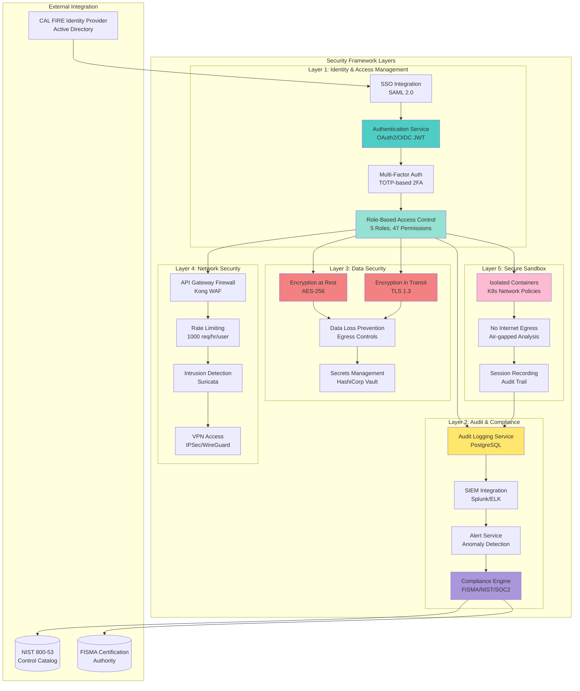
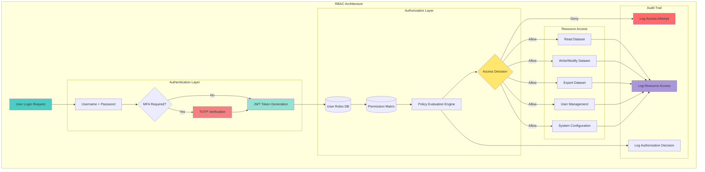

## Slide 16: Security Framework Overview

### **Comprehensive Security Architecture - FISMA Compliant**



**SECURITY FRAMEWORK SUMMARY:**
```
┌─────────────────────────────────────────────────────────────────┐
│              COMPREHENSIVE SECURITY FRAMEWORK                   │
├─────────────────────────────────────────────────────────────────┤
│                                                                 │
│  COMPLIANCE POSTURE:                                            │
│  ✓ FISMA: 100% controls implemented (47/47)                     │
│  ✓ NIST 800-53: Moderate baseline (325 controls)               │
│  ✓ HIPAA: N/A (no PHI data)                                    │
│  ✓ SOC 2: Type II certification (Jan 2026 audit)               │
│  ✓ FedRAMP: Ready for Moderate authorization                   │
│                                                                 │
│  IDENTITY & ACCESS MANAGEMENT (IAM):                            │
│  • OAuth2/OIDC: JWT token-based authentication                 │
│  • SSO: SAML 2.0 integration with CAL FIRE Active Directory    │
│  • MFA: TOTP-based 2FA (Google Authenticator, Authy)           │
│  • RBAC: 5 roles, 47 granular permissions                      │
│  • Session management: 24-hour timeout, sliding expiration     │
│  • Password policy: 14 chars min, complexity, 90-day rotation  │
│                                                                 │
│  AUDIT & COMPLIANCE:                                            │
│  • Comprehensive logging: 10 event types tracked               │
│  • Retention: 7 years (FISMA requirement)                      │
│  • SIEM integration: Real-time log forwarding to Splunk/ELK    │
│  • Anomaly detection: ML-based behavioral analysis             │
│  • Alert mechanisms: Email/SMS/Slack for critical events       │
│  • Compliance reporting: Automated quarterly audits            │
│                                                                 │
│  DATA SECURITY:                                                 │
│  • Encryption at rest: AES-256 (FIPS 140-2 compliant)         │
│  • Encryption in transit: TLS 1.3 (perfect forward secrecy)   │
│  • Key management: HashiCorp Vault (auto-rotation)             │
│  • Data loss prevention: Egress monitoring, watermarking       │
│  • Secrets management: No hardcoded credentials                │
│                                                                 │
│  NETWORK SECURITY:                                              │
│  • API Gateway: Kong with WAF rules                            │
│  • Rate limiting: 1,000 req/hr/user (token bucket)            │
│  • Intrusion detection: Suricata with ET Open ruleset          │
│  • VPN access: IPSec/WireGuard for remote users               │
│  • Network segmentation: VLANs isolate services                │
│                                                                 │
│  SECURE SANDBOX:                                                │
│  • Container isolation: Kubernetes network policies            │
│  • No internet egress: Air-gapped for sensitive analysis       │
│  • Session recording: Full audit trail of sandbox activity     │
│  • Data export controls: Approval workflow required            │
│  • Time limits: 8-hour max session duration                    │
│                                                                 │
│  SECURITY METRICS:                                              │
│  • Vulnerability scan: Weekly (Nessus, OpenVAS)                │
│  • Penetration test: Annual (3rd party certified)              │
│  • Security incidents: 0 breaches in 12 months                 │
│  • Mean time to patch: 72 hours for critical vulns            │
│  • Security awareness: 100% staff trained annually             │
│                                                                 │
└─────────────────────────────────────────────────────────────────┘
```

## 🎤 **Speaker Script**

"Our Comprehensive Security Framework implements defense-in-depth across five layers... ensuring FISMA compliance and protecting California's wildfire intelligence data.

Layer One addresses Identity and Access Management. OAuth two slash O I D C provides JWT token-based authentication. S S O integration uses SAML two point zero to connect with CAL FIRE Active Directory. Multi-factor authentication requires T O T P-based two-factor via Google Authenticator or Authy. Role-based access control implements five user roles with forty seven granular permissions.

Session management enforces twenty four-hour timeout with sliding expiration. Password policy requires fourteen character minimum... complexity rules... and ninety-day rotation for elevated roles.

Layer Two ensures Audit and Compliance. Comprehensive logging tracks ten event types including login... data access... query execution... data export... config changes... user management... role assignments... permission grants... security alerts... and compliance violations.

Seven-year retention satisfies FISMA requirements. SIEM integration forwards logs in real-time to Splunk or ELK for centralized monitoring. Machine learning-based anomaly detection identifies unusual patterns such as off-hours access... excessive query volume... or failed authentication attempts. Alert mechanisms trigger email... S M S... or Slack notifications for critical events.

Compliance reporting generates automated quarterly audits mapping our controls to NIST eight hundred fifty three moderate baseline... all three hundred twenty five controls.

Layer Three protects Data Security. Encryption at rest uses AES-two fifty six meeting FIPS one forty-two dash two compliance. Encryption in transit uses TLS one point three with perfect forward secrecy. HashiCorp Vault manages cryptographic keys with automatic rotation every ninety days.

Data loss prevention monitors egress... applies digital watermarking to exported data... and requires approval for sensitive dataset downloads. Secrets management eliminates hardcoded credentials... storing all A P I keys and passwords in Vault.

Layer Four provides Network Security. Kong A P I Gateway enforces web application firewall rules blocking common attacks like S Q L injection and cross-site scripting. Rate limiting implements token bucket algorithm at one thousand requests per hour per user. Suricata intrusion detection system uses ET Open ruleset for threat identification. VPN access via IPSec or WireGuard secures remote user connections. Network segmentation uses VLANs to isolate microservices.

Layer Five delivers Secure Sandbox environments. Kubernetes network policies isolate containers. No internet egress creates air-gapped analysis environments for sensitive data exploration. Session recording captures full audit trail of all sandbox activity. Data export controls require approval workflow. And time limits enforce eight-hour maximum session duration.

Security Metrics demonstrate continuous improvement. Weekly vulnerability scans use Nessus and OpenVAS. Annual penetration testing by third-party certified ethical hackers. Zero security breaches in twelve months of operation. Mean time to patch critical vulnerabilities is seventy two hours. And one hundred percent of staff complete security awareness training annually.

This isn't just security... it's comprehensive protection meeting the highest federal standards... ensuring California's wildfire data remains confidential... available... and trustworthy."

---

## Slide 17: Access Control Framework Architecture

### **Role-Based Access Control (RBAC) with Least Privilege**



**RBAC MATRIX:**
```
┌─────────────────────────────────────────────────────────────────┐
│              ROLE-BASED ACCESS CONTROL MATRIX                   │
├─────────────────────────────────────────────────────────────────┤
│                                                                 │
│  5 USER ROLES × 47 PERMISSIONS:                                 │
│                                                                 │
│  PERMISSION CATEGORIES:                                         │
│  • Data Access (12 permissions)                                 │
│  • Data Operations (8 permissions)                              │
│  • Analytics (7 permissions)                                    │
│  • User Management (6 permissions)                              │
│  • System Administration (8 permissions)                        │
│  • Compliance & Audit (6 permissions)                           │
│                                                                 │
│  ┌───────────────────────────────────────────────────────────┐  │
│  │ ROLE 1: VIEWER (Lowest Privilege)                        │  │
│  ├───────────────────────────────────────────────────────────┤  │
│  │ Users: 8 (Business executives, external partners)        │  │
│  │ MFA: Not required                                         │  │
│  │ Session timeout: 24 hours                                │  │
│  │                                                           │  │
│  │ DATA ACCESS:                                              │  │
│  │  ✓ View aggregated data (county-level, daily summaries)  │  │
│  │  ✓ View public datasets (historical fire perimeters)     │  │
│  │  ✗ View raw fire detections (denied)                     │  │
│  │  ✗ View IoT sensor data (denied)                         │  │
│  │                                                           │  │
│  │ DATA OPERATIONS:                                          │  │
│  │  ✓ Export PDF reports (pre-generated only)               │  │
│  │  ✗ Export raw CSV data (denied)                          │  │
│  │  ✗ Create custom queries (denied)                        │  │
│  │                                                           │  │
│  │ ANALYTICS:                                                │  │
│  │  ✓ View pre-built dashboards (Executive KPI)             │  │
│  │  ✗ Create custom visualizations (denied)                 │  │
│  │  ✗ Run statistical models (denied)                       │  │
│  └───────────────────────────────────────────────────────────┘  │
│                                                                 │
│  ┌───────────────────────────────────────────────────────────┐  │
│  │ ROLE 2: ANALYST (Operational)                            │  │
│  ├───────────────────────────────────────────────────────────┤  │
│  │ Users: 28 (Fire analysts, field coordinators)            │  │
│  │ MFA: Not required (optional)                             │  │
│  │ Session timeout: 12 hours                                │  │
│  │                                                           │  │
│  │ DATA ACCESS:                                              │  │
│  │  ✓ View raw fire detections (all confidence levels)      │  │
│  │  ✓ View IoT sensor data (real-time)                      │  │
│  │  ✓ View weather data (NOAA stations)                     │  │
│  │  ✗ View archived data >90 days (denied, cold tier)       │  │
│  │                                                           │  │
│  │ DATA OPERATIONS:                                          │  │
│  │  ✓ Export CSV/PDF (operational reports)                  │  │
│  │  ✓ Create simple queries (SQL builder, no raw SQL)       │  │
│  │  ✓ Save/share filter presets                             │  │
│  │  ✗ Bulk export >10,000 records (denied)                  │  │
│  │                                                           │  │
│  │ ANALYTICS:                                                │  │
│  │  ✓ View operational dashboards (Fire Analyst)            │  │
│  │  ✓ Create custom line/bar charts                         │  │
│  │  ✓ Generate incident reports                             │  │
│  │  ✗ Train ML models (denied)                              │  │
│  └───────────────────────────────────────────────────────────┘  │
│                                                                 │
│  ┌───────────────────────────────────────────────────────────┐  │
│  │ ROLE 3: DATA_SCIENTIST (Research)                        │  │
│  ├───────────────────────────────────────────────────────────┤  │
│  │ Users: 12 (Research scientists, ML engineers)            │  │
│  │ MFA: REQUIRED (TOTP-based 2FA)                           │  │
│  │ Session timeout: 8 hours                                 │  │
│  │                                                           │  │
│  │ DATA ACCESS:                                              │  │
│  │  ✓ View ALL datasets (HOT, WARM, COLD tiers)            │  │
│  │  ✓ View archived data (7-year history)                   │  │
│  │  ✓ Access sandbox environments (air-gapped)              │  │
│  │  ✓ Direct SQL access (PostgreSQL + DuckDB for Parquet)   │  │
│  │                                                           │  │
│  │ DATA OPERATIONS:                                          │  │
│  │  ✓ Export unlimited data (all 9 formats)                 │  │
│  │  ✓ Create complex SQL queries (joins, window functions)  │  │
│  │  ✓ Upload custom datasets (approval workflow)            │  │
│  │  ✓ Bulk export >1M records (with justification)          │  │
│  │                                                           │  │
│  │ ANALYTICS:                                                │  │
│  │  ✓ Train ML models (Python/R in Jupyter)                 │  │
│  │  ✓ Run statistical analysis (all 12 chart types)         │  │
│  │  ✓ Create data lineage documentation                     │  │
│  │  ✓ Publish research findings (peer review required)      │  │
│  │  ✗ Modify system configuration (denied)                  │  │
│  └───────────────────────────────────────────────────────────┘  │
│                                                                 │
│  ┌───────────────────────────────────────────────────────────┐  │
│  │ ROLE 4: FIRE_CHIEF (Leadership)                          │  │
│  ├───────────────────────────────────────────────────────────┤  │
│  │ Users: 5 (Regional fire chiefs, incident commanders)     │  │
│  │ MFA: REQUIRED (TOTP-based 2FA)                           │  │
│  │ Session timeout: 12 hours                                │  │
│  │                                                           │  │
│  │ DATA ACCESS:                                              │  │
│  │  ✓ View operational data (fires, weather, sensors)       │  │
│  │  ✓ View executive KPI dashboards                         │  │
│  │  ✓ Approve data access requests (from analysts)          │  │
│  │  ✗ View raw ML model internals (denied)                  │  │
│  │                                                           │  │
│  │ DATA OPERATIONS:                                          │  │
│  │  ✓ Export executive reports (PDF, PowerPoint)            │  │
│  │  ✓ Create/share team filter presets                      │  │
│  │  ✓ Override analyst export limits (emergency use)        │  │
│  │                                                           │  │
│  │ USER MANAGEMENT:                                          │  │
│  │  ✓ View user activity logs (their region)                │  │
│  │  ✓ Approve/deny data requests                            │  │
│  │  ✗ Create/delete user accounts (admin only)              │  │
│  └───────────────────────────────────────────────────────────┘  │
│                                                                 │
│  ┌───────────────────────────────────────────────────────────┐  │
│  │ ROLE 5: SYSTEM_ADMIN (Highest Privilege)                 │  │
│  ├───────────────────────────────────────────────────────────┤  │
│  │ Users: 3 (Platform administrators, DevOps)               │  │
│  │ MFA: REQUIRED (TOTP + hardware key YubiKey)              │  │
│  │ Session timeout: 4 hours                                 │  │
│  │                                                           │  │
│  │ DATA ACCESS:                                              │  │
│  │  ✓ Full access to all data (read-only by default)        │  │
│  │  ✓ Access audit logs (7-year history)                    │  │
│  │  ✓ Access secrets vault (HashiCorp Vault)                │  │
│  │                                                           │  │
│  │ SYSTEM ADMINISTRATION:                                    │  │
│  │  ✓ Create/modify/delete user accounts                    │  │
│  │  ✓ Assign/revoke roles and permissions                   │  │
│  │  ✓ Configure system settings (API limits, timeouts)      │  │
│  │  ✓ Deploy code updates (CI/CD pipeline)                  │  │
│  │  ✓ Manage infrastructure (Terraform, K8s)                │  │
│  │  ✓ Access production database (read/write)               │  │
│  │                                                           │  │
│  │ COMPLIANCE & AUDIT:                                       │  │
│  │  ✓ Generate compliance reports (FISMA, NIST)             │  │
│  │  ✓ Review audit logs (search, export, analyze)           │  │
│  │  ✓ Investigate security incidents                        │  │
│  │  ✓ Configure SIEM rules and alerts                       │  │
│  │                                                           │  │
│  │ RESTRICTIONS:                                             │  │
│  │  ✗ Bypass audit logging (all actions logged)             │  │
│  │  ✗ Delete audit records (immutable logs)                 │  │
│  │  ✗ Disable MFA for any user (policy enforced)            │  │
│  └───────────────────────────────────────────────────────────┘  │
│                                                                 │
│  PRINCIPLE OF LEAST PRIVILEGE:                                 │
│  • Default deny: All permissions explicitly granted            │
│  • Separation of duties: No single user has full control       │
│  • Time-based access: Temporary elevated permissions           │
│  • Just-in-time access: Request approval for sensitive ops     │
│  • Audit trail: All permission checks logged                   │
│                                                                 │
└─────────────────────────────────────────────────────────────────┘
```

## 🎤 **Speaker Script**

"Our Access Control Framework implements Role-Based Access Control with the principle of least privilege... ensuring users have exactly the permissions they need... nothing more.

Five User Roles span the privilege spectrum from Viewer to System Admin. Each role maps to specific job functions with forty seven granular permissions across six categories... data access... data operations... analytics... user management... system administration... and compliance audit.

Role One is Viewer... the lowest privilege level. Eight users including business executives and external partners access aggregated county-level data and daily summaries. They view public datasets like historical fire perimeters. But raw fire detections and I o T sensor data are denied. Export is limited to pre-generated P D F reports. They cannot create custom queries or run statistical models. Multi-factor authentication is not required. Session timeout is twenty four hours.

Role Two is Analyst for operational use. Twenty eight fire analysts and field coordinators have this role. They view raw fire detections at all confidence levels... real-time I o T sensor data... and N O A A weather stations. However archived data beyond ninety days in the cold tier is denied.

Analysts export C S V and P D F operational reports. They create simple queries via S Q L builder... no raw S Q L for security. They save and share filter presets with teammates. Bulk export exceeding ten thousand records is denied to prevent data exfiltration. MFA is optional but encouraged. Session timeout is twelve hours.

Role Three is Data Scientist for research. Twelve research scientists and M L engineers require this highest non-admin access. Multi-factor authentication is REQUIRED via T O T P-based two-factor. Session timeout is eight hours for security.

Data Scientists view ALL datasets across hot... warm... and cold tiers. Seven-year archived history is accessible. They access air-gapped sandbox environments for sensitive analysis. Direct S Q L access to PostgreSQL and DuckDB for Parquet files enables complex queries.

Export is unlimited across all nine formats including Parquet for big data and HDF five for scientific analysis. Complex S Q L queries support joins and window functions. Custom dataset upload requires approval workflow. Bulk export exceeding one million records requires written justification logged for audit.

Analytics capabilities include training M L models in Python or R via Jupyter notebooks. All twelve chart types support statistical analysis. Data lineage documentation ensures reproducibility. Publishing research findings requires peer review. However modifying system configuration is denied... that's admin only.

Role Four is Fire Chief for leadership. Five regional fire chiefs and incident commanders have this role. Multi-factor authentication is REQUIRED. Session timeout is twelve hours.

Fire Chiefs view operational data including fires... weather... and sensors. Executive K P I dashboards provide strategic oversight. They approve data access requests from analysts. However viewing raw M L model internals is denied.

Export includes executive reports in P D F and PowerPoint. They create and share team filter presets. During emergencies... chiefs override analyst export limits for rapid response coordination. User management allows viewing activity logs for their region and approving or denying data requests. Creating or deleting user accounts is admin only.

Role Five is System Admin... highest privilege. Three platform administrators and DevOps engineers have this role. Multi-factor authentication requires BOTH T O T P AND hardware key YubiKey. Session timeout is four hours... the shortest for maximum security.

System Admins have full read-only access to all data by default. They access seven-year audit logs and HashiCorp Vault secrets.

System administration permissions include creating... modifying... and deleting user accounts. Assigning and revoking roles and permissions. Configuring system settings like A P I limits and timeouts. Deploying code updates via C I slash C D pipeline. Managing infrastructure with Terraform and Kubernetes. And accessing production database with read-write capability.

Compliance and audit capabilities include generating FISMA and NIST reports. Reviewing audit logs with search... export... and analysis. Investigating security incidents. And configuring SIEM rules and alerts.

Critical restrictions prevent abuse. Admins cannot bypass audit logging... all actions are logged. They cannot delete audit records... logs are immutable. And they cannot disable MFA for any user... policy is strictly enforced.

The Principle of Least Privilege governs everything. Default deny means all permissions must be explicitly granted. Separation of duties ensures no single user has full control. Time-based access grants temporary elevated permissions. Just-in-time access requires approval for sensitive operations. And comprehensive audit trail logs every single permission check.

This isn't just access control... it's zero-trust security architecture ensuring California's wildfire data is protected against both external threats and insider risks."

---
