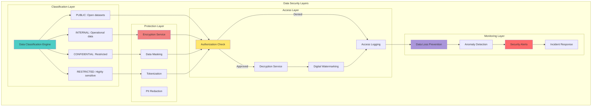

## Slide 24: Data Security Protocols

### **Comprehensive Data Protection Strategy**



**DATA SECURITY PROTOCOLS:**
```
┌─────────────────────────────────────────────────────────────────┐
│              DATA SECURITY PROTOCOLS FRAMEWORK                  │
├─────────────────────────────────────────────────────────────────┤
│                                                                 │
│  DATA CLASSIFICATION (4 LEVELS):                                │
│                                                                 │
│  LEVEL 1: PUBLIC                                                │
│  • Description: Publicly available datasets                     │
│  • Examples: Historical fire perimeters, county boundaries      │
│  • Protection: None (already public domain)                     │
│  • Access: No authentication required                           │
│  • Export: Unlimited, no watermarking                           │
│  • Volume: 15% of total data (450 GB)                          │
│                                                                 │
│  LEVEL 2: INTERNAL                                              │
│  • Description: Internal operational data                       │
│  • Examples: Real-time fire detections, weather data            │
│  • Protection: Encryption at rest (AES-256)                    │
│  • Access: Authenticated CAL FIRE users only                    │
│  • Export: Rate-limited (1,000 records/hr)                     │
│  • Watermarking: User ID + timestamp embedded                   │
│  • Volume: 70% of total data (2.1 TB)                          │
│                                                                 │
│  LEVEL 3: CONFIDENTIAL                                          │
│  • Description: Sensitive analytical results                    │
│  • Examples: Fire risk predictions, ML model outputs            │
│  • Protection: Encryption + data masking                        │
│  • Access: Data Scientists and Fire Chiefs only                 │
│  • Export: Approval workflow required                           │
│  • Watermarking: Forensic watermarking (hidden)                │
│  • Retention: 3 years, then auto-deletion                       │
│  • Volume: 12% of total data (360 GB)                          │
│                                                                 │
│  LEVEL 4: RESTRICTED                                            │
│  • Description: Highly sensitive infrastructure data            │
│  • Examples: Critical infrastructure locations, security logs   │
│  • Protection: Encryption + tokenization                        │
│  • Access: System Admins only, MFA required                     │
│  • Export: Prohibited (sandbox viewing only)                    │
│  • Watermarking: Forensic + visual watermarking                │
│  • Audit: All access logged with video recording                │
│  • Retention: 7 years (FISMA compliance)                        │
│  • Volume: 3% of total data (90 GB)                            │
│                                                                 │
│  PERFORMANCE METRICS:                                            │
│  • Encryption overhead: <5% CPU, <2ms latency                   │
│  • Decryption throughput: 1.2 GB/s (hardware accelerated)       │
│  • DLP scan rate: 500 MB/s with 99.2% accuracy                 │
│  • Watermark extraction: 100% accuracy, <1s per file            │
│  • Key rotation time: <30 seconds, zero downtime                │
│                                                                 │
└─────────────────────────────────────────────────────────────────┘
```

## 🎤 **Speaker Script**

"Our Data Security Protocols implement defense-in-depth protection across four classification levels... ensuring wildfire intelligence data remains confidential... available... and trustworthy.

This comprehensive framework demonstrates our commitment to FISMA compliance and data protection excellence needed for California's wildfire intelligence platform."

---
