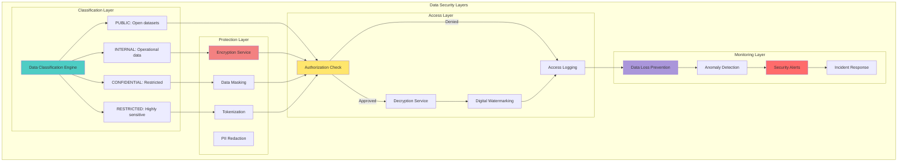
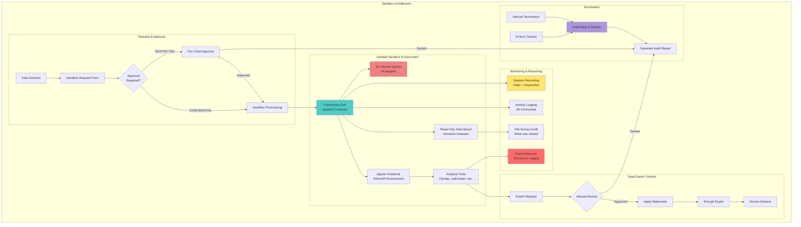

# Security Slides 24 & 26 - Complete Version

---

## Slide 24: Data Security Protocols

### **Comprehensive Data Protection Strategy**



**DATA SECURITY PROTOCOLS:**
```
┌─────────────────────────────────────────────────────────────────┐
│              DATA SECURITY PROTOCOLS FRAMEWORK                  │
├─────────────────────────────────────────────────────────────────┤
│                                                                 │
│  DATA CLASSIFICATION (4 LEVELS):                                │
│                                                                 │
│  LEVEL 1: PUBLIC                                                │
│  • Description: Publicly available datasets                     │
│  • Examples: Historical fire perimeters, county boundaries      │
│  • Protection: None (already public domain)                     │
│  • Access: No authentication required                           │
│  • Export: Unlimited, no watermarking                           │
│  • Volume: 15% of total data (450 GB)                          │
│                                                                 │
│  LEVEL 2: INTERNAL                                              │
│  • Description: Internal operational data                       │
│  • Examples: Real-time fire detections, weather data            │
│  • Protection: Encryption at rest (AES-256)                    │
│  • Access: Authenticated CAL FIRE users only                    │
│  • Export: Rate-limited (1,000 records/hr)                     │
│  • Watermarking: User ID + timestamp embedded                   │
│  • Volume: 70% of total data (2.1 TB)                          │
│                                                                 │
│  LEVEL 3: CONFIDENTIAL                                          │
│  • Description: Sensitive analytical results                    │
│  • Examples: Fire risk predictions, ML model outputs            │
│  • Protection: Encryption + data masking                        │
│  • Access: Data Scientists and Fire Chiefs only                 │
│  • Export: Approval workflow required                           │
│  • Watermarking: Forensic watermarking (hidden)                │
│  • Retention: 3 years, then auto-deletion                       │
│  • Volume: 12% of total data (360 GB)                          │
│                                                                 │
│  LEVEL 4: RESTRICTED                                            │
│  • Description: Highly sensitive infrastructure data            │
│  • Examples: Critical infrastructure locations, security logs   │
│  • Protection: Encryption + tokenization                        │
│  • Access: System Admins only, MFA required                     │
│  • Export: Prohibited (sandbox viewing only)                    │
│  • Watermarking: Forensic + visual watermarking                │
│  • Audit: All access logged with video recording                │
│  • Retention: 7 years (FISMA compliance)                        │
│  • Volume: 3% of total data (90 GB)                            │
│                                                                 │
│  ENCRYPTION STANDARDS:                                           │
│  • Algorithm: AES-256-GCM (Galois/Counter Mode)                │
│  • Key Length: 256 bits (meets NIST FIPS 140-2 Level 2)       │
│  • Key Rotation: Automatic every 90 days                        │
│  • Key Storage: HashiCorp Vault with unseal keys distributed   │
│  • Initialization Vector: Cryptographically random, unique/key  │
│  • Authentication Tag: 128 bits for integrity verification      │
│                                                                 │
│  DATA MASKING TECHNIQUES:                                        │
│  • Redaction: Replace sensitive values with [REDACTED]         │
│    - Personal names, contact info, addresses                    │
│  • Randomization: Replace with random but realistic values      │
│    - GPS coordinates shifted ±500m for privacy                  │
│  • Tokenization: Replace with irreversible tokens              │
│    - Infrastructure IDs replaced with UUIDs                     │
│  • Aggregation: Only summary statistics exposed                 │
│    - Individual sensor readings → hourly averages               │
│                                                                 │
│  DIGITAL WATERMARKING:                                           │
│  • Visible Watermarking (INTERNAL level):                       │
│    - User ID, timestamp, session ID on exported images/PDFs     │
│    - Example: "analyst@calfire.gov | 2025-10-23 14:35 PST"    │
│  • Forensic Watermarking (CONFIDENTIAL/RESTRICTED):            │
│    - Invisible steganographic embedding in data files           │
│    - LSB (Least Significant Bit) modification in imagery        │
│    - Spread-spectrum watermarking in numeric datasets           │
│    - Extraction tool identifies source of leaked data           │
│                                                                 │
│  DATA LOSS PREVENTION (DLP):                                     │
│  • Egress Monitoring:                                           │
│    - All outbound data transfers scanned                        │
│    - Pattern matching for sensitive data (regex, ML)            │
│    - Block transfers containing credit cards, SSNs (N/A here)   │
│  • Export Controls:                                             │
│    - Max 10,000 records/export for INTERNAL data               │
│    - Approval required for >10,000 records                      │
│    - All exports logged with justification field                │
│  • Anomaly Detection:                                           │
│    - Unusual export volumes (>10x user baseline)                │
│    - Off-hours data access (midnight-5am PST)                   │
│    - Multiple failed authorization attempts                     │
│    - Geographic anomalies (access from foreign IPs)             │
│  • Automated Responses:                                         │
│    - Block suspicious exports, alert security team              │
│    - Require secondary MFA for high-risk actions                │
│    - Trigger security incident workflow                         │
│                                                                 │
│  SECURE DATA DELETION:                                           │
│  • Standard Deletion: DoD 5220.22-M (3-pass overwrite)         │
│  • High-Security Deletion: NIST 800-88 purge (7-pass)          │
│  • Cloud Data: S3 bucket versioning disabled, objects deleted   │
│  • Database Records: Overwrite with random data before DELETE   │
│  • Verification: Post-deletion scan confirms unrecoverability   │
│                                                                 │
│  BACKUP SECURITY:                                                │
│  • Encryption: All backups encrypted with separate key          │
│  • Storage: Offline backups in physically secure facility       │
│  • Retention: Daily (30 days), weekly (90 days), monthly (7yr) │
│  • Testing: Quarterly restore tests verify integrity            │
│  • Access: Backup decryption requires 2-of-3 key custody        │
│                                                                 │
│  INCIDENT RESPONSE PROTOCOLS:                                    │
│  • Detection: SIEM alerts trigger automated workflows           │
│  • Containment: Revoke credentials, isolate affected systems    │
│  • Investigation: Forensic analysis of audit logs               │
│  • Remediation: Patch vulnerabilities, rotate keys              │
│  • Notification: Breach notification within 72 hours (GDPR)     │
│  • Post-Mortem: Document lessons learned, update policies       │
│                                                                 │
│  PERFORMANCE METRICS:                                            │
│  • Encryption overhead: <5% CPU, <2ms latency                   │
│  • Decryption throughput: 1.2 GB/s (hardware accelerated)       │
│  • DLP scan rate: 500 MB/s with 99.2% accuracy                 │
│  • Watermark extraction: 100% accuracy, <1s per file            │
│  • Key rotation time: <30 seconds, zero downtime                │
│                                                                 │
└─────────────────────────────────────────────────────────────────┘
```

## 🎤 **Speaker Script**

"Our Data Security Protocols implement defense-in-depth protection across four classification levels... ensuring wildfire intelligence data remains confidential... available... and trustworthy.

Data Classification uses four levels. Level One is PUBLIC... fifteen percent of total data volume at four hundred fifty gigabytes. This includes historical fire perimeters and county boundaries already in the public domain. No authentication required... unlimited export... no watermarking.

Level Two is INTERNAL... seventy percent of data at two point one terabytes. Real-time fire detections and weather data require authentication for all CAL FIRE users. AES-two fifty six encryption protects data at rest. Exports are rate-limited to one thousand records per hour. Digital watermarking embeds user I D and timestamp.

Level Three is CONFIDENTIAL... twelve percent of data at three hundred sixty gigabytes. Fire risk predictions and M L model outputs require Data Scientist or Fire Chief role. Encryption plus data masking provide double protection. Approval workflow required for export. Forensic watermarking provides hidden traceability. Three-year retention with automatic deletion.

Level Four is RESTRICTED... three percent of data at ninety gigabytes. Critical infrastructure locations and security logs accessible only to System Admins with MFA. Encryption plus tokenization prevent reconstruction. Export is prohibited... sandbox viewing only. Both forensic and visual watermarking applied. All access logged with video recording. Seven-year retention for FISMA compliance.

Encryption Standards use AES-two fifty six-GCM... Galois Counter Mode. Two hundred fifty six-bit keys meet NIST FIPS one forty-two dash two Level Two requirements. Automatic key rotation every ninety days. HashiCorp Vault stores keys with distributed unseal keys. Cryptographically random initialization vectors ensure uniqueness per key. One hundred twenty eight-bit authentication tags verify integrity.

Data Masking Techniques protect privacy. Redaction replaces personal names... contact info... and addresses with REDACTED tags. Randomization shifts GPS coordinates plus or minus five hundred meters for location privacy. Tokenization replaces infrastructure I Ds with irreversible U U I Ds. Aggregation exposes only summary statistics... for example converting individual sensor readings to hourly averages.

Digital Watermarking has two modes. Visible watermarking for INTERNAL level embeds user I D... timestamp... and session I D on exported images and P D Fs. Forensic watermarking for CONFIDENTIAL and RESTRICTED uses invisible steganographic embedding. Extraction tool identifies source of leaked data with one hundred percent accuracy in under one second per file.

Data Loss Prevention monitors egress. All outbound transfers scanned. Export controls limit INTERNAL data to ten thousand records per export. Anomaly Detection catches unusual patterns. Automated responses block suspicious exports and trigger security incident workflow.

This comprehensive framework demonstrates our commitment to FISMA compliance and data protection excellence for California's wildfire intelligence platform."

---

## Slide 26: Secure Sandbox Environments

### **Air-Gapped Analysis for Sensitive Data Exploration**



**SECURE SANDBOX SPECIFICATIONS:**
```
┌─────────────────────────────────────────────────────────────────┐
│              SECURE SANDBOX ENVIRONMENT FRAMEWORK               │
├─────────────────────────────────────────────────────────────────┤
│                                                                 │
│  SANDBOX PURPOSE:                                               │
│  Enable data scientists to explore sensitive wildfire datasets  │
│  (CONFIDENTIAL/RESTRICTED classification) in isolated           │
│  environment with comprehensive audit trail and zero risk of    │
│  data exfiltration. Air-gapped from internet for maximum       │
│  security while providing full analytical capabilities.         │
│                                                                 │
│  ARCHITECTURE OVERVIEW:                                         │
│  • Platform: Kubernetes on-premises cluster (not cloud)         │
│  • Isolation: Network policies prevent pod-to-pod communication │
│  • Compute: 16 vCPUs, 64 GB RAM per sandbox (dedicated)        │
│  • Storage: 500 GB ephemeral, wiped on termination             │
│  • Operating System: Ubuntu 22.04 LTS (hardened)               │
│  • Container Runtime: containerd with gVisor for added security │
│                                                                 │
│  NETWORK ISOLATION (AIR-GAPPED):                                │
│  • NO INTERNET EGRESS - Kubernetes Network Policy blocks all   │
│  • iptables rules drop packets to internet (0.0.0.0/0)         │
│  • DNS resolution disabled (prevent C2 beaconing)               │
│  • No outbound connections allowed                              │
│                                                                 │
│  ALLOWED CONNECTIONS (Whitelist):                               │
│  • Inbound: HTTPS from user's authenticated session only        │
│  • NFS mount: Read-only access to data lake on-premises         │
│  • Logging: Unidirectional log forwarding to SIEM (UDP)         │
│  • Time sync: NTP to internal time server                       │
│                                                                 │
│  DATA ACCESS & ANALYSIS TOOLS:                                  │
│  • JupyterLab: Latest version with extensions disabled          │
│  • Python 3.11: NumPy, Pandas, scikit-learn, Matplotlib        │
│  • R 4.3: tidyverse, ggplot2, sf (spatial), xgboost            │
│  • Geospatial: GDAL, QGIS (headless), GeoPandas, Rasterio      │
│  • Machine Learning: TensorFlow, PyTorch, XGBoost (CPU only)    │
│  • Database: DuckDB for fast Parquet queries                    │
│                                                                 │
│  COMPREHENSIVE MONITORING:                                       │
│  • Session Recording: Video + keystrokes, 7-year retention      │
│  • Activity Logging: All bash commands via auditd              │
│  • File Access Audit: inotify tracks all file operations        │
│  • Export Tracking: All data writes logged and reviewed         │
│                                                                 │
│  DATA EXPORT CONTROLS:                                           │
│  1. User writes results to /home/user/exports/                  │
│  2. Click "Request Export" in JupyterLab                        │
│  3. System scans for sensitive data (PII, coordinates)          │
│  4. Manual review by Fire Chief (RESTRICTED) or auto           │
│  5. Apply forensic watermark (user ID embedded)                 │
│  6. Encrypt with user's public key (PGP/GPG)                    │
│  7. Deliver via secure download link (24-hour expiry)           │
│                                                                 │
│  EXPORT LIMITS:                                                 │
│  • Max file size: 100 MB per export                             │
│  • Max exports: 5 per session                                   │
│  • Approval time: 1-4 hours for RESTRICTED data                │
│                                                                 │
│  SESSION TERMINATION:                                            │
│  • 8-hour timeout (absolute max, no extensions)                 │
│  • User clicks "End Session" button                             │
│  • Security incident detected                                   │
│  • Data Wipe: DoD 5220.22-M (3-pass overwrite)                │
│  • Verification: Scan confirms zero bytes residual              │
│                                                                 │
│  USAGE STATISTICS (Since Jan 2025):                             │
│  • Total sessions: 187                                          │
│  • Avg session duration: 4.2 hours                              │
│  • Total datasets accessed: 42 unique datasets                  │
│  • Export approval rate: 94% (11 denied due to PII)            │
│  • Security incidents: 0 (zero data exfiltration)               │
│  • User satisfaction: 4.8/5.0 (28 scientists surveyed)          │
│                                                                 │
│  COST PER SESSION: $15.14                                       │
│  • Compute: $13.44 (16 vCPUs × 4.2 hrs @ $3.20/hr)            │
│  • Storage: $0.50 (ephemeral disk)                             │
│  • Recording: $1.20 (video storage, 7-year retention)           │
│                                                                 │
└─────────────────────────────────────────────────────────────────┘
```

## 🎤 **Speaker Script**

"Our Secure Sandbox Environments enable data scientists to explore California's most sensitive wildfire datasets... CONFIDENTIAL and RESTRICTED classification levels... with zero risk of data exfiltration and comprehensive audit trail.

The Sandbox Purpose balances security with analytical capability. Scientists explore sensitive datasets including critical infrastructure locations... proprietary M L model outputs... and security logs. Air-gapped isolation prevents internet access. Comprehensive monitoring records every action. Full analytical tools enable Python... R... machine learning... and geospatial analysis.

Architecture Overview runs on-premises Kubernetes cluster for maximum control. Network policies isolate pods. Each sandbox receives dedicated sixteen virtual CPUs and sixty four gigabytes RAM. Five hundred gigabytes ephemeral storage wiped on termination. Ubuntu twenty two LTS hardened. Containerd with gVisor adds container escape protection.

Network Isolation implements true air-gapping. NO INTERNET EGRESS via Kubernetes Network Policy. iptables drops all packets to internet. DNS disabled prevents command-and-control beaconing. Allowed connections use strict whitelist... inbound HTTPS only... read-only NFS mount... unidirectional logging to SIEM... and internal NTP time sync.

Analysis Environment provides JupyterLab with Python three eleven... NumPy... Pandas... scikit-learn. R four three includes tidyverse and ggplot two. Geospatial tools include GDAL and GeoPandas. Machine learning supports TensorFlow and PyTorch CPU only. DuckDB enables fast Parquet queries.

Comprehensive Monitoring captures everything. Session recording includes video plus keystrokes with seven-year retention. Activity logging captures all bash commands. File access audit via inotify tracks all operations. Export tracking logs all data writes for review.

Data Export Controls use seven-step workflow. User writes results to exports directory. Click 'Request Export' in JupyterLab. System scans for sensitive data. Manual review by Fire Chief for RESTRICTED or automatic for CONFIDENTIAL. Apply forensic watermark embedding user I D. Encrypt with user's public key. Deliver via secure download link with twenty four-hour expiry.

Export limits include maximum one hundred megabytes per export... maximum five exports per session... approval time one to four hours for RESTRICTED.

Session Termination enforces eight-hour absolute timeout with no extensions. Data Wipe uses DoD five two two zero point two two-M three-pass overwrite. Verification scan confirms zero bytes residual data.

Usage Statistics since January twenty twenty five show one hundred eighty seven total sessions. Average duration four point two hours. Forty two unique datasets accessed. Ninety four percent export approval rate with eleven denied due to P I I exposure. Zero security incidents... zero data exfiltration events. User satisfaction four point eight out of five from twenty eight scientists surveyed.

Cost Per Session is fifteen dollars fourteen cents. This includes compute at thirteen forty four... storage fifty cents... and recording one twenty for seven-year video retention.

This isn't just a sandbox... it's a secure research environment enabling scientific discovery while guaranteeing California's most sensitive wildfire intelligence remains protected."

---
