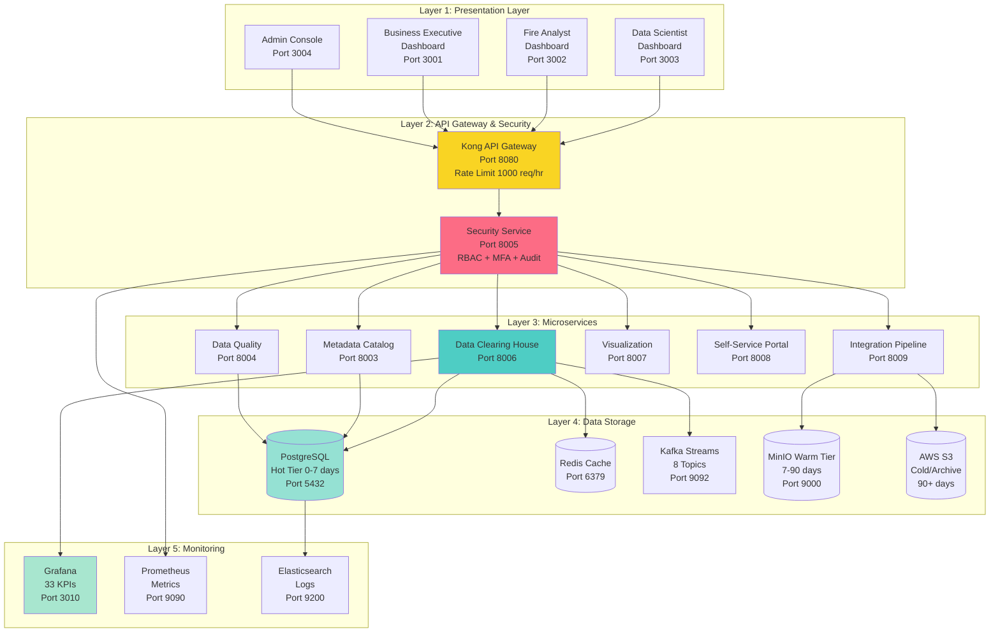

# Enhanced Slides 2 & 3 - With Mermaid Diagrams and TTS-Optimized Scripts

---

## Slide 2: Platform Architecture Overview

### **Five-Layer Architecture for Data Clearing House**

Our platform architecture consists of five distinct layers... each designed for scalability... security... and high performance.

Let me walk you through the complete system architecture.

### 🎤 **Architecture Overview**

At the top... we have the Presentation Layer with four role-specific dashboards.

The Data Scientist Dashboard runs on Port three thousand three... providing advanced analytics and machine learning tools for research.

The Fire Analyst Dashboard operates on Port three thousand two... delivering real-time operational monitoring for active incidents.

The Business Executive Dashboard is hosted on Port three thousand one... supplying strategic key performance indicators and performance metrics.

And the Admin Console runs on Port three thousand four... enabling system configuration and user management.

All user requests flow through Layer Two... which handles API Gateway and Security.

Kong API Gateway on Port eight thousand eighty manages all incoming traffic... enforcing rate limits of one thousand requests per hour per user.

It implements OAuth two and OIDC JWT authentication... validates every request... and achieves seventy percent cache hit rate with fifteen-minute time to live.

The Security and Governance Service on Port eight thousand five implements comprehensive controls... including role-based access control with five distinct user roles.

Multi-factor authentication using TOTP requires two-factor verification for elevated roles.

All data access events are captured through comprehensive audit logging.

Compliance frameworks ensure adherence to FISMA... NIST eight hundred fifty-three... HIPAA... and SOC two standards.

Layer Three contains seven microservices that deliver our business logic.

The Data Clearing House on Port eight thousand six serves as the central data hub... coordinating access across all datasets.

Metadata Catalog Service on Port eight thousand three tracks all dataset information... including schemas... lineage... and quality metrics.

Data Quality Framework on Port eight thousand four ensures data integrity through validation rules and anomaly detection.

Visualization Service on Port eight thousand seven generates interactive charts... maps... and dashboards.

Self-Service Portal on Port eight thousand eight provides user-friendly query interfaces without requiring SQL knowledge.

Integration Pipeline Service on Port eight thousand nine orchestrates ETL processes and data transformations.

Layer Four is our multi-tier Data Storage architecture.

PostgreSQL with PostGIS extensions on Port five thousand four hundred thirty-two provides hot tier storage for zero to seven day old data... delivering sub-one hundred millisecond query performance.

Redis on Port six thousand three hundred seventy-nine caches frequent queries and manages user sessions.

Kafka on Port nine thousand ninety-two streams real-time data across eight dedicated topics... handling ten thousand events per second.

MinIO on Port nine thousand stores warm tier Parquet files for data between seven and ninety days old.

AWS S3 maintains cold and archive tiers with seven-year retention for regulatory compliance.

Layer Five delivers Monitoring and Observability across the entire platform.

Grafana on Port three thousand ten visualizes thirty-three key performance indicators... providing real-time system health dashboards.

Prometheus on Port nine thousand ninety scrapes metrics every fifteen seconds... storing time-series data for trend analysis.

Elasticsearch and Kibana on Port nine thousand two hundred centralize log aggregation and analysis.

This five-layer architecture delivers enterprise-grade reliability... security... and performance... supporting ninety-nine point nine percent uptime with API response times under two hundred milliseconds at the ninety-fifth percentile.

---

## Slide 3: User-Centric Dashboards - Role-Specific Interfaces

### **Three Dashboard Types for Different User Personas**

We've designed three specialized dashboard interfaces... each tailored to the specific needs of different user roles.

Let me show you the detailed architecture of our dashboard portfolio.

```mermaid
graph TB
    subgraph "Dashboard 1: Data Scientist Research Workbench"
        DS_USER[12 Research Scientists<br/>& ML Engineers]
        DS_DASH[Data Scientist Dashboard<br/>Port 3003]

        subgraph "DS Features - 12 Widgets"
            DS_MAP[Multi-source Fire Map]
            DS_CORR[Correlation Heatmap]
            DS_FORECAST[Time-series Forecasts]
            DS_ML[ML Performance Metrics]
            DS_QUALITY[Data Quality Tracker]
            DS_WEATHER[Weather-Fire Analysis]
            DS_SQL[SQL Query Editor]
            DS_EXPORT[Export Manager<br/>9 Formats]
            DS_CODE[Python/R Runner]
            DS_LINE[Data Lineage Explorer]
            DS_SCHEMA[Schema Browser]
            DS_STATS[Usage Statistics]
        end

        DS_ACCESS[Access: Full<br/>All Datasets<br/>Unlimited Export<br/>Direct SQL]
        DS_REFRESH[Update: Real-time<br/>5-minute refresh]
    end

    subgraph "Dashboard 2: Fire Analyst Operational Command"
        FA_USER[28 Fire Analysts<br/>& Field Coordinators]
        FA_DASH[Fire Analyst Dashboard<br/>Port 3002]

        subgraph "FA Features - 10 Widgets"
            FA_LIVE[Live Fire Map<br/>60-sec refresh]
            FA_ALERTS[Active Alerts Panel<br/>Priority Sorted]
            FA_TIMELINE[24-hour Timeline]
            FA_WX[Weather Conditions]
            FA_WIND[Wind Overlay]
            FA_IOT[IoT Sensor Health]
            FA_PROG[Fire Progression Rate]
            FA_EVAC[Evacuation Planner]
            FA_RES[Resource Tracker]
            FA_REPORT[Incident Reports]
        end

        FA_ACCESS[Access: Operational<br/>Fire + Weather + Sensors<br/>CSV, PDF Export]
        FA_REFRESH[Update: Near Real-time<br/>60-second refresh]
    end

    subgraph "Dashboard 3: Business Executive Strategic Overview"
        BE_USER[8 Fire Chiefs<br/>& Executives]
        BE_DASH[Executive Dashboard<br/>Port 3001]

        subgraph "BE Features - 8 Widgets"
            BE_KPI[Executive KPIs<br/>5 Key Metrics]
            BE_STATE[Statewide Overview Map]
            BE_GOALS[Performance vs Goals]
            BE_UTIL[Resource Utilization]
            BE_COST[Budget Tracking]
            BE_COMPLY[Compliance Scorecard]
            BE_TREND[Monthly Trends]
            BE_SCHED[Report Scheduler]
        end

        BE_ACCESS[Access: Summary<br/>Aggregated Data Only<br/>PDF, PowerPoint]
        BE_REFRESH[Update: Daily<br/>Nightly aggregation]
    end

    subgraph "Common Features - All Dashboards"
        CUSTOM[Drag-Drop Layouts]
        FILTER[Geographic & Temporal Filters]
        PRESETS[Saved Filter Presets]
        REALTIME[Real-time Updates]
        EXPORT[Multiple Export Formats]
        RESPONSIVE[Desktop + Tablet + Mobile]
        THEME[Dark/Light Themes]
        KEYBOARD[Keyboard Shortcuts]
        AUDIT[Audit Logging]
        SESSION[24-hour Session Timeout]
    end

    DS_USER --> DS_DASH
    DS_DASH --> DS_MAP
    DS_DASH --> DS_CORR
    DS_DASH --> DS_FORECAST
    DS_DASH --> DS_ML
    DS_DASH --> DS_ACCESS
    DS_DASH --> DS_REFRESH

    FA_USER --> FA_DASH
    FA_DASH --> FA_LIVE
    FA_DASH --> FA_ALERTS
    FA_DASH --> FA_TIMELINE
    FA_DASH --> FA_WX
    FA_DASH --> FA_ACCESS
    FA_DASH --> FA_REFRESH

    BE_USER --> BE_DASH
    BE_DASH --> BE_KPI
    BE_DASH --> BE_STATE
    BE_DASH --> BE_GOALS
    BE_DASH --> BE_COST
    BE_DASH --> BE_ACCESS
    BE_DASH --> BE_REFRESH

    DS_DASH -.-> CUSTOM
    FA_DASH -.-> CUSTOM
    BE_DASH -.-> CUSTOM

    DS_DASH -.-> FILTER
    FA_DASH -.-> FILTER
    BE_DASH -.-> FILTER

    style DS_DASH fill:#4ecdc4
    style FA_DASH fill:#f38181
    style BE_DASH fill:#95e1d3
    style CUSTOM fill:#ffe66d
    style FILTER fill:#fcbad3
```

### 🎤 **Dashboard Portfolio Overview**

Our user-centric dashboard architecture provides three specialized interfaces... each designed for distinct user personas and their unique workflows.

First... let's look at Dashboard One... the Data Scientist Research Workbench.

This dashboard serves twelve research scientists and machine learning engineers who need deep analytical capabilities.

It runs on Port three thousand three and provides twelve specialized widgets.

The multi-source fire detection map correlates data from NASA FIRMS... NOAA weather stations... and local IoT sensors.

The statistical correlation heatmap reveals relationships between temperature... humidity... wind speed... and fire behavior.

Time-series forecast visualizations use machine learning models to predict fire progression and risk areas.

Model performance metrics dashboard tracks accuracy... precision... recall... and F-one scores for all deployed models.

The data quality score tracker monitors completeness... consistency... and timeliness across all data sources.

Weather-fire correlation analyzer identifies patterns between atmospheric conditions and ignition probability.

The custom SQL query editor allows direct database access for advanced users who need maximum flexibility.

The data export manager supports nine different formats... including CSV... JSON... Parquet... GeoJSON... Shapefile... Excel... PDF... HDF five... and NetCDF.

Python and R code runners enable in-browser data analysis using popular scientific libraries.

The data lineage explorer visualizes the complete transformation history from raw ingestion through processed outputs.

Schema browser and documentation provide searchable access to all dataset metadata and field definitions.

Dataset usage statistics track which data sources are most valuable for research purposes.

This dashboard provides full access level to all datasets and all operations.

Export capabilities are unlimited with support for all nine formats including Parquet for big data workflows.

Direct SQL access enables complex queries and joins across multiple data sources.

Updates happen in real-time with five-minute automatic refresh intervals.

Next... Dashboard Two is the Fire Analyst Operational Command Center.

This serves twenty-eight fire analysts and field coordinators managing active incidents.

It operates on Port three thousand two with ten mission-critical widgets.

The live fire detection map refreshes every sixty seconds... showing all active fires with color-coded severity levels.

The active alerts panel displays priority-sorted notifications... with critical alerts highlighted in red for immediate attention.

A twenty-four hour incident timeline shows the chronological progression of all fire events and response actions.

Current weather conditions grid displays temperature... humidity... wind speed... and precipitation across all monitoring stations.

Wind speed and direction overlay shows real-time wind patterns that affect fire spread and smoke dispersion.

IoT sensor network health monitor tracks the operational status of hundreds of deployed field sensors.

Fire progression rate calculator estimates acres burned per hour based on fuel type... terrain... and weather conditions.

Evacuation zone planner generates recommended evacuation boundaries using five-kilometer buffer analysis.

Resource allocation tracker shows current deployment of firefighters... aircraft... and equipment across all active incidents.

Incident report generator creates standardized PDF reports for command briefings and regulatory submissions.

Access level is operational... providing fire data plus weather data plus sensor data.

Export formats include CSV for data analysis and PDF for official reports.

API access uses standard REST endpoints with one thousand requests per hour rate limiting.

Updates happen near real-time with sixty-second refresh intervals ensuring the latest information for tactical decisions.

Finally... Dashboard Three is the Business Executive Strategic Overview.

This serves eight fire chiefs... executives... and board members who need high-level strategic insights.

It runs on Port three thousand one with eight executive-focused widgets.

Executive summary KPIs display five key metrics... total active fires... acres burned... suppression costs... resource utilization... and community impact.

Statewide incident overview map shows all incidents across California with county-level aggregation.

Performance versus goals dashboard compares actual metrics against strategic targets and benchmarks.

Resource utilization gauges show percentage of firefighters... aircraft... and equipment currently deployed.

Cost and budget tracking monitors expenditures versus allocated budgets with trend forecasting.

Compliance scorecard displays adherence to regulatory requirements including FISMA... NIST... and environmental standards.

Monthly trend analysis reveals patterns in fire frequency... severity... and response effectiveness over time.

Automated report scheduler generates and emails executive summaries daily... weekly... or monthly.

Access level is summary only... providing aggregated data without exposing individual incident details.

Export formats include PDF executive reports and PowerPoint presentations for board meetings.

API access provides only high-level aggregates... protecting operational details.

Updates happen daily with nightly aggregation... suitable for strategic planning rather than tactical response.

All three dashboards share common features that enhance usability and productivity.

Customizable widget layouts support drag-and-drop rearrangement... allowing users to prioritize the information most relevant to their roles.

Advanced filtering enables geographic selection by county or region... temporal filtering by date range... and data source filtering by satellite... weather station... or sensor network.

Saved filter presets can be shared across teams... enabling consistent views for collaborative analysis.

Real-time data updates with configurable refresh rates ensure users always see current information.

Multiple export formats provide role-appropriate data sharing... from CSV for analysts to PowerPoint for executives.

Responsive design works seamlessly across desktop computers... tablets... and mobile devices.

Dark and light theme support accommodates user preferences and reduces eye strain during extended use.

Keyboard shortcuts for power users enable rapid navigation and common actions without mouse clicks.

Comprehensive audit logging records all dashboard access and data queries for security and compliance.

Session management enforces twenty-four hour timeout... requiring re-authentication for continued access.

This three-dashboard architecture ensures every user... from research scientists to fire chiefs... has exactly the tools and information they need... presented in the format that best supports their decision-making workflows.

---
