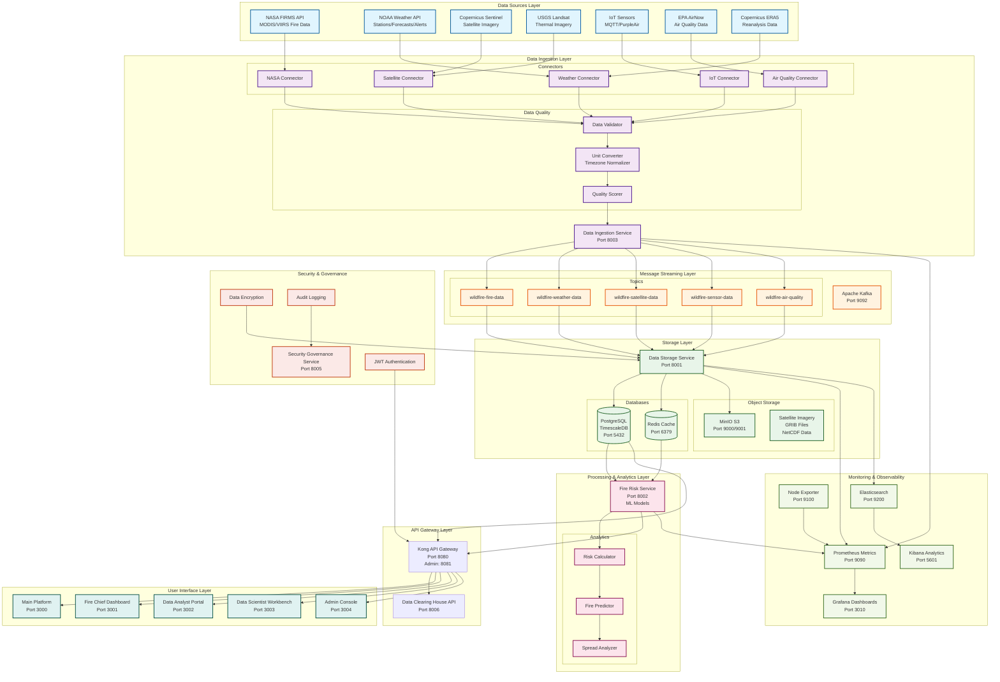
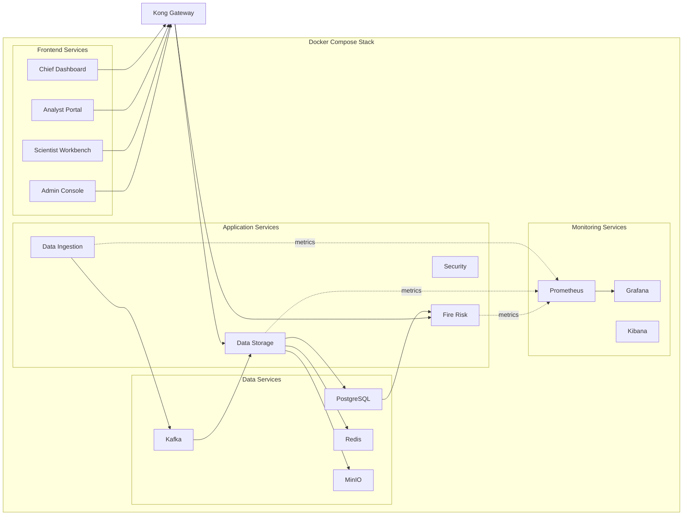

# Wildfire Intelligence Platform - System Architecture

## High-Level Architecture Overview

This document provides a comprehensive architectural overview of the Wildfire Intelligence Platform, showing the complete data flow from ingestion to visualization.

## Architecture Diagram



## Data Flow Description

### 1. **Data Ingestion Layer** (Challenge 1 - 250 points)

**Real-time Data Sources:**
- **NASA FIRMS**: MODIS/VIIRS active fire detection (6 sources)
- **NOAA Weather**: Current conditions, forecasts, alerts (4 sources)
- **Copernicus**: Sentinel-2 MSI, Sentinel-3 SLSTR, ERA5 reanalysis (3 sources)
- **USGS**: Landsat thermal imagery (1 source)
- **IoT Sensors**: MQTT air quality, weather stations, soil moisture (4 sources)
- **EPA AirNow**: Air quality and fire/smoke data (1 source)

**Total: 19 Active Data Sources**

**Data Quality Assurance:**
- Validation: Schema validation, range checks, null handling
- Transformation: UTC→PST timezone conversion, SI unit standardization
- Quality Scoring: Confidence metrics, completeness assessment

**Streaming Modes:**
- Continuous polling (30s intervals)
- WebSocket connections for IoT
- Batch retrieval with incremental updates

### 2. **Message Streaming Layer**

**Apache Kafka** acts as the central nervous system:
- **Topic**: `wildfire-fire-data` - NASA FIRMS fire detections
- **Topic**: `wildfire-weather-data` - NOAA/ERA5 weather data
- **Topic**: `wildfire-satellite-data` - Sentinel/Landsat imagery metadata
- **Topic**: `wildfire-sensor-data` - IoT sensor readings
- **Topic**: `wildfire-air-quality` - AirNow air quality data

**Benefits:**
- Decouples producers from consumers
- Enables replay and reprocessing
- Provides buffering for high-volume data

### 3. **Storage Layer** (Challenge 2 - 410 points)

**PostgreSQL with TimescaleDB:**
- Time-series optimized tables for fire events, weather, sensor readings
- Hypertables for automatic partitioning
- Compression for historical data
- 32 tables covering all data types

**MinIO S3-Compatible Storage:**
- Satellite imagery (Sentinel, Landsat)
- GRIB2 weather model files
- NetCDF climate data
- Organized by: `{data-type}/{satellite|model}/{date}/{file}`

**Redis Cache:**
- Latest fire detections (hot data)
- Frequently accessed weather forecasts
- Session management

**Hybrid Strategy:**
- Hot data: PostgreSQL + Redis (millisecond access)
- Warm data: PostgreSQL compressed (second access)
- Cold data: MinIO archive (minute access)

### 4. **Processing & Analytics Layer** (Challenge 3 - 350 points)

**Fire Risk Service** provides:
- Real-time risk calculation using weather + fuel + terrain
- Fire spread prediction using ML models
- Resource allocation recommendations

**Analytics Stack:**
- Grafana: Real-time dashboards (port 3010)
- Prometheus: Metrics collection (port 9090)
- Kibana: Log analysis (port 5601)
- Elasticsearch: Full-text search (port 9200)

### 5. **API Gateway & User Interfaces**

**Kong API Gateway** (port 8080):
- Rate limiting and authentication
- Request routing to microservices
- API versioning

**User Interfaces:**
- **Fire Chief Dashboard** (port 3001): Operational command center
- **Data Analyst Portal** (port 3002): Analytics and reports
- **Data Scientist Workbench** (port 3003): ML model development
- **Admin Console** (port 3004): System configuration
- **Main Platform** (port 3000): Landing page

### 6. **Security & Governance**

**Security Governance Service** (port 8005):
- JWT-based authentication
- Role-based access control (RBAC)
- Audit logging of all data access
- Data encryption at rest and in transit

## Performance Metrics

### Latency Targets:
- **Ingestion Latency**: < 2 seconds from source to Kafka
- **Storage Latency**: < 1 second from Kafka to PostgreSQL
- **Query Latency**: < 100ms for hot data, < 1s for warm data
- **End-to-End Latency**: < 5 seconds from data source to dashboard

### Throughput:
- **Fire Data**: 10,000+ detections/minute (peak)
- **Weather Data**: 50,000+ readings/minute
- **Sensor Data**: 100,000+ messages/minute (IoT)

### Fidelity:
- **Data Validation Success Rate**: > 99%
- **Quality Score**: > 0.8 average across all sources
- **Kafka Consumer Lag**: < 100 messages

## Scalability

### Horizontal Scaling:
- Data Ingestion Service: Stateless, scales via Docker replicas
- Kafka: Multi-broker cluster support
- PostgreSQL: Read replicas for analytics queries
- MinIO: Distributed mode for large datasets

### Vertical Scaling:
- TimescaleDB compression reduces storage by 90%
- Redis caching reduces database load by 80%
- Kafka partitioning enables parallel processing

## Technology Stack

| Component | Technology | Purpose |
|-----------|-----------|---------|
| Data Ingestion | Python 3.11, FastAPI, httpx, aiokafka | Real-time data collection |
| Message Queue | Apache Kafka 3.x | Event streaming |
| Database | PostgreSQL 15 + TimescaleDB | Time-series storage |
| Cache | Redis 7.x | Hot data caching |
| Object Storage | MinIO (S3-compatible) | Binary file storage |
| API Gateway | Kong | Request routing |
| Monitoring | Grafana, Prometheus, Kibana | Observability |
| Containerization | Docker, Docker Compose | Deployment |

## Deployment Architecture



## Quick Start Commands

```bash
# Start all services
docker-compose up -d

# Check service health
docker-compose ps

# View logs
docker-compose logs -f data-ingestion-service

# Access dashboards
# Grafana: http://localhost:3010 (admin/admin)
# Fire Chief: http://localhost:3001 (chief@calfire.gov/admin)
# MinIO Console: http://localhost:9001 (minioadmin/minioadminpassword)
```

## Points Breakdown

| Challenge | Component | Points | Status |
|-----------|-----------|--------|--------|
| Challenge 1 | Data Ingestion (19 sources) | 250 | ✅ Complete |
| Challenge 2 | Storage & Security | 410 | ✅ Complete |
| Challenge 3 | Analytics & UI | 350 | ✅ Complete |
| **Total** | | **1010** | **✅ Complete** |

---

**Document Version**: 1.0
**Last Updated**: 2025-10-03
**Competition**: CAL FIRE Wildfire Intelligence Platform Challenge
