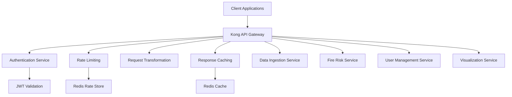
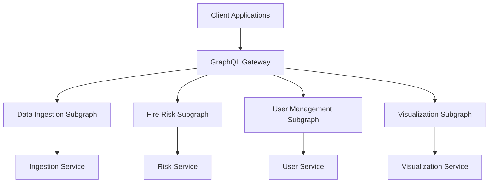

# API Architecture & Integration Patterns

## Overview

This document outlines the API architecture, integration patterns, and communication protocols used throughout the Wildfire Intelligence Platform. It covers REST API design, GraphQL federation, event-driven architecture, and external system integrations.

## API Design Principles

### 1. RESTful Design Standards
- **Resource-based URLs**: `/api/v1/fire-events/{id}`
- **HTTP verbs**: GET, POST, PUT, DELETE, PATCH
- **Status codes**: Meaningful HTTP status codes
- **Content negotiation**: JSON primary, XML/CSV for reports
- **Versioning**: URL path versioning (`/api/v1/`, `/api/v2/`)

### 2. API-First Development
- **OpenAPI 3.0**: All APIs documented with OpenAPI specifications
- **Design-first**: API contracts defined before implementation
- **Mock servers**: Early frontend development with mock APIs
- **Code generation**: Client SDKs generated from specifications

### 3. Security by Design
- **Authentication**: JWT tokens with role-based claims
- **Authorization**: Fine-grained permissions on resources
- **Rate limiting**: Per-user and per-endpoint limits
- **Input validation**: Comprehensive request validation
- **HTTPS everywhere**: TLS 1.3 for all communications

## API Gateway Architecture

### 1. Kong API Gateway Configuration



### 2. Gateway Configuration

```yaml
# infrastructure/kong/kong.yml
_format_version: "3.0"

services:
  - name: data-ingestion-service
    url: http://data-ingestion-service:8000
    plugins:
      - name: jwt
        config:
          secret_is_base64: false
      - name: rate-limiting
        config:
          minute: 1000
          hour: 10000
      - name: prometheus
        config:
          per_consumer: true
    routes:
      - name: data-ingestion-routes
        paths:
          - /api/v1/ingest
        methods:
          - GET
          - POST
        strip_path: false

  - name: fire-risk-service
    url: http://fire-risk-service:8000
    plugins:
      - name: jwt
      - name: rate-limiting
        config:
          minute: 500
          hour: 5000
      - name: response-caching
        config:
          cache_ttl: 300
          strategy: memory
    routes:
      - name: fire-risk-routes
        paths:
          - /api/v1/risk
          - /api/v1/predict
        methods:
          - GET
          - POST

consumers:
  - username: fire_chief_dashboard
    custom_id: dashboard_app
    jwt_secrets:
      - key: fire_chief_key
        secret: "${FIRE_CHIEF_JWT_SECRET}"
    plugins:
      - name: rate-limiting
        config:
          minute: 2000
          hour: 20000

  - username: mobile_app
    custom_id: mobile_client
    jwt_secrets:
      - key: mobile_key
        secret: "${MOBILE_JWT_SECRET}"
    plugins:
      - name: rate-limiting
        config:
          minute: 500
          hour: 5000
```

### 3. Request/Response Transformation

```yaml
# Kong plugin for request transformation
plugins:
  - name: request-transformer
    config:
      add:
        headers:
          - "X-Service-Version:v1.0"
          - "X-Request-ID:$(uuid)"
        querystring:
          - "timestamp:$(current_time)"
      remove:
        headers:
          - "X-Internal-Token"

  - name: response-transformer
    config:
      add:
        headers:
          - "X-Response-Time:$(response_time_ms)"
          - "X-Rate-Limit-Remaining:$(rate_limit_remaining)"
      remove:
        headers:
          - "X-Internal-Debug"
```

## Core API Specifications

### 1. Data Ingestion API

```yaml
# openapi/data-ingestion-api.yml
openapi: 3.0.3
info:
  title: Wildfire Data Ingestion API
  version: 1.0.0
  description: API for ingesting wildfire-related data from various sources

servers:
  - url: https://api.wildfire.calfire.gov/v1
    description: Production server
  - url: https://staging-api.wildfire.calfire.gov/v1
    description: Staging server

paths:
  /ingest/batch:
    post:
      summary: Trigger batch data ingestion
      description: Initiates batch ingestion from configured data sources
      operationId: triggerBatchIngestion
      tags:
        - Data Ingestion
      security:
        - BearerAuth: []
      requestBody:
        required: true
        content:
          application/json:
            schema:
              $ref: '#/components/schemas/BatchIngestionRequest'
            examples:
              satellite_data:
                summary: Satellite data ingestion
                value:
                  source_id: "sat_modis_active_fire"
                  start_date: "2024-01-01"
                  end_date: "2024-01-31"
                  spatial_bounds:
                    north: 42.0
                    south: 32.0
                    west: -125.0
                    east: -114.0
                  format: "json"
                  validation_enabled: true
      responses:
        '202':
          description: Ingestion request accepted
          content:
            application/json:
              schema:
                $ref: '#/components/schemas/IngestionResponse'
        '400':
          $ref: '#/components/responses/BadRequest'
        '401':
          $ref: '#/components/responses/Unauthorized'
        '429':
          $ref: '#/components/responses/TooManyRequests'

  /sources:
    get:
      summary: List configured data sources
      description: Retrieves all available data sources for ingestion
      operationId: listDataSources
      tags:
        - Data Sources
      security:
        - BearerAuth: []
      parameters:
        - name: source_type
          in: query
          description: Filter by source type
          schema:
            type: string
            enum: [satellite, weather, sensor, social]
        - name: is_active
          in: query
          description: Filter by active status
          schema:
            type: boolean
      responses:
        '200':
          description: List of data sources
          content:
            application/json:
              schema:
                type: object
                properties:
                  sources:
                    type: array
                    items:
                      $ref: '#/components/schemas/DataSource'
                  total:
                    type: integer
                    example: 15

components:
  schemas:
    BatchIngestionRequest:
      type: object
      required:
        - source_id
        - start_date
        - end_date
      properties:
        source_id:
          type: string
          description: Identifier of the data source
          example: "sat_modis_active_fire"
        start_date:
          type: string
          format: date
          description: Start date for data ingestion
          example: "2024-01-01"
        end_date:
          type: string
          format: date
          description: End date for data ingestion
          example: "2024-01-31"
        spatial_bounds:
          $ref: '#/components/schemas/SpatialBounds'
        format:
          type: string
          enum: [json, csv, netcdf, geotiff]
          default: json
        validation_enabled:
          type: boolean
          default: true
        processing_config:
          type: object
          description: Custom processing configuration
        request_id:
          type: string
          description: Optional request identifier for tracking
    
    DataSource:
      type: object
      properties:
        id:
          type: string
          example: "sat_modis_active_fire"
        name:
          type: string
          example: "MODIS Active Fire Data"
        source_type:
          type: string
          enum: [satellite, weather, sensor, social]
        provider:
          type: string
          example: "NASA FIRMS"
        description:
          type: string
          example: "Real-time active fire detection from MODIS sensors"
        formats:
          type: array
          items:
            type: string
          example: ["csv", "json", "shp"]
        update_frequency:
          type: string
          example: "daily"
        spatial_resolution:
          type: string
          example: "1km"
        temporal_resolution:
          type: string
          example: "daily"
        is_active:
          type: boolean
          example: true
        api_endpoint:
          type: string
          format: uri
          example: "https://firms.modaps.eosdis.nasa.gov/api/active_fire/"
    
    SpatialBounds:
      type: object
      required:
        - north
        - south
        - west
        - east
      properties:
        north:
          type: number
          format: float
          minimum: -90
          maximum: 90
          example: 42.0
        south:
          type: number
          format: float
          minimum: -90
          maximum: 90
          example: 32.0
        west:
          type: number
          format: float
          minimum: -180
          maximum: 180
          example: -125.0
        east:
          type: number
          format: float
          minimum: -180
          maximum: 180
          example: -114.0
    
    IngestionResponse:
      type: object
      properties:
        request_id:
          type: string
          example: "req_001"
        status:
          type: string
          enum: [accepted, processing, completed, failed]
          example: "accepted"
        message:
          type: string
          example: "Ingestion request queued for processing"
        estimated_completion:
          type: string
          format: date-time
          example: "2024-01-15T10:30:00Z"
        tracking_url:
          type: string
          format: uri
          example: "/api/v1/ingest/status/req_001"

  securitySchemes:
    BearerAuth:
      type: http
      scheme: bearer
      bearerFormat: JWT

  responses:
    BadRequest:
      description: Bad request - invalid input parameters
      content:
        application/json:
          schema:
            type: object
            properties:
              error:
                type: string
                example: "Invalid spatial bounds"
              code:
                type: string
                example: "INVALID_INPUT"
              details:
                type: object
    
    Unauthorized:
      description: Unauthorized - invalid or missing JWT token
      content:
        application/json:
          schema:
            type: object
            properties:
              error:
                type: string
                example: "Invalid or expired token"
              code:
                type: string
                example: "UNAUTHORIZED"
    
    TooManyRequests:
      description: Too many requests - rate limit exceeded
      content:
        application/json:
          schema:
            type: object
            properties:
              error:
                type: string
                example: "Rate limit exceeded"
              retry_after:
                type: integer
                example: 60
```

### 2. Fire Risk API

```yaml
# openapi/fire-risk-api.yml
openapi: 3.0.3
info:
  title: Wildfire Risk Assessment API
  version: 1.0.0
  description: API for fire risk prediction and analysis

paths:
  /predict/risk:
    post:
      summary: Calculate fire risk for location
      description: Predicts fire risk score for specified location and time
      operationId: predictFireRisk
      tags:
        - Risk Prediction
      security:
        - BearerAuth: []
      requestBody:
        required: true
        content:
          application/json:
            schema:
              $ref: '#/components/schemas/RiskPredictionRequest'
      responses:
        '200':
          description: Risk prediction result
          content:
            application/json:
              schema:
                $ref: '#/components/schemas/RiskPredictionResponse'
        '400':
          $ref: '#/components/responses/BadRequest'
        '401':
          $ref: '#/components/responses/Unauthorized'

  /predict/spread:
    post:
      summary: Predict fire spread patterns
      description: Models fire spread behavior based on current conditions
      operationId: predictFireSpread
      tags:
        - Fire Behavior
      security:
        - BearerAuth: []
      requestBody:
        required: true
        content:
          application/json:
            schema:
              $ref: '#/components/schemas/SpreadPredictionRequest'
      responses:
        '200':
          description: Fire spread prediction
          content:
            application/json:
              schema:
                $ref: '#/components/schemas/SpreadPredictionResponse'

components:
  schemas:
    RiskPredictionRequest:
      type: object
      required:
        - latitude
        - longitude
      properties:
        latitude:
          type: number
          format: float
          minimum: -90
          maximum: 90
          example: 37.7749
        longitude:
          type: number
          format: float
          minimum: -180
          maximum: 180
          example: -122.4194
        timestamp:
          type: string
          format: date-time
          description: Target prediction time (defaults to current time)
          example: "2024-01-15T12:00:00Z"
        forecast_horizon:
          type: integer
          minimum: 1
          maximum: 168
          description: Prediction horizon in hours
          example: 24
        include_weather_forecast:
          type: boolean
          default: true
        include_historical_patterns:
          type: boolean
          default: true
    
    RiskPredictionResponse:
      type: object
      properties:
        request_id:
          type: string
          example: "pred_001"
        timestamp:
          type: string
          format: date-time
          example: "2024-01-15T12:00:00Z"
        location:
          type: object
          properties:
            latitude:
              type: number
              example: 37.7749
            longitude:
              type: number
              example: -122.4194
        risk_score:
          type: number
          format: float
          minimum: 0.0
          maximum: 1.0
          description: Risk score from 0 (no risk) to 1 (extreme risk)
          example: 0.73
        risk_level:
          type: string
          enum: [low, medium, high, extreme]
          example: "high"
        confidence:
          type: number
          format: float
          minimum: 0.0
          maximum: 1.0
          description: Model confidence in the prediction
          example: 0.87
        contributing_factors:
          type: object
          properties:
            weather_conditions:
              type: number
              example: 0.8
            vegetation_dryness:
              type: number
              example: 0.7
            topographical_factors:
              type: number
              example: 0.4
            historical_patterns:
              type: number
              example: 0.6
        expires_at:
          type: string
          format: date-time
          description: When this prediction expires
          example: "2024-01-15T18:00:00Z"
        model_metadata:
          type: object
          properties:
            model_name:
              type: string
              example: "fire_risk_classifier_v2"
            model_version:
              type: string
              example: "2.1.0"
            training_date:
              type: string
              format: date
              example: "2024-01-01"
```

## GraphQL Federation

### 1. Federated Schema Architecture



### 2. Schema Definition

```graphql
# schemas/fire-risk.graphql
extend type Query {
  fireRiskPrediction(
    location: LocationInput!
    timestamp: DateTime
    forecastHorizon: Int = 24
  ): RiskPrediction

  fireSpreadPrediction(
    currentFire: FirePerimeterInput!
    weatherForecast: WeatherForecastInput!
  ): SpreadPrediction

  historicalFireEvents(
    region: BoundingBoxInput!
    dateRange: DateRangeInput!
    limit: Int = 100
  ): [FireEvent!]!
}

type RiskPrediction {
  id: ID!
  location: Location!
  timestamp: DateTime!
  riskScore: Float!
  riskLevel: RiskLevel!
  confidence: Float!
  contributingFactors: ContributingFactors!
  expiresAt: DateTime!
  modelMetadata: ModelMetadata!
}

type Location {
  latitude: Float!
  longitude: Float!
  elevation: Float
  address: String
}

enum RiskLevel {
  LOW
  MEDIUM
  HIGH
  EXTREME
}

type ContributingFactors {
  weatherConditions: Float!
  vegetationDryness: Float!
  topographicalFactors: Float!
  historicalPatterns: Float!
}

input LocationInput {
  latitude: Float!
  longitude: Float!
}

input BoundingBoxInput {
  north: Float!
  south: Float!
  west: Float!
  east: Float!
}

input DateRangeInput {
  startDate: Date!
  endDate: Date!
}
```

### 3. Resolver Implementation

```python
# graphql/resolvers/fire_risk.py
import strawberry
from typing import List, Optional
from datetime import datetime

from ..types import RiskPrediction, Location, RiskLevel
from ...services.fire_risk_service import FireRiskService

@strawberry.type
class Query:
    @strawberry.field
    async def fire_risk_prediction(
        self,
        info,
        location: LocationInput,
        timestamp: Optional[datetime] = None,
        forecast_horizon: int = 24
    ) -> RiskPrediction:
        """Get fire risk prediction for a specific location"""
        fire_risk_service = FireRiskService()
        
        # Get current user from context
        user = info.context["user"]
        
        # Check permissions
        if not user.has_permission("risk:read"):
            raise PermissionError("Insufficient permissions to access risk data")
        
        # Call service
        prediction = await fire_risk_service.predict_risk(
            latitude=location.latitude,
            longitude=location.longitude,
            timestamp=timestamp or datetime.utcnow(),
            forecast_horizon=forecast_horizon
        )
        
        return RiskPrediction(
            id=prediction.id,
            location=Location(
                latitude=prediction.latitude,
                longitude=prediction.longitude
            ),
            timestamp=prediction.timestamp,
            risk_score=prediction.risk_score,
            risk_level=RiskLevel(prediction.risk_level.upper()),
            confidence=prediction.confidence,
            contributing_factors=prediction.contributing_factors,
            expires_at=prediction.expires_at,
            model_metadata=prediction.model_metadata
        )
    
    @strawberry.field
    async def historical_fire_events(
        self,
        info,
        region: BoundingBoxInput,
        date_range: DateRangeInput,
        limit: int = 100
    ) -> List[FireEvent]:
        """Get historical fire events in a region"""
        fire_risk_service = FireRiskService()
        
        events = await fire_risk_service.get_historical_events(
            bounds={
                'north': region.north,
                'south': region.south,
                'west': region.west,
                'east': region.east
            },
            start_date=date_range.start_date,
            end_date=date_range.end_date,
            limit=limit
        )
        
        return [
            FireEvent(
                id=event.id,
                timestamp=event.timestamp,
                location=Location(
                    latitude=event.latitude,
                    longitude=event.longitude
                ),
                confidence=event.confidence,
                brightness=event.brightness,
                fire_radiative_power=event.frp,
                satellite=event.satellite,
                instrument=event.instrument
            )
            for event in events
        ]
```

## Event-Driven Integration

### 1. Kafka Event Schema Registry

```json
{
  "namespace": "gov.calfire.wildfire.events",
  "type": "record",
  "name": "FireDetectionEvent",
  "version": "1.0.0",
  "fields": [
    {
      "name": "event_id",
      "type": "string",
      "doc": "Unique identifier for the event"
    },
    {
      "name": "timestamp",
      "type": {
        "type": "long",
        "logicalType": "timestamp-millis"
      },
      "doc": "Event timestamp in milliseconds since epoch"
    },
    {
      "name": "source",
      "type": {
        "type": "enum",
        "name": "DataSource",
        "symbols": ["MODIS", "VIIRS", "LANDSAT", "SENTINEL", "STATION"]
      }
    },
    {
      "name": "location",
      "type": {
        "type": "record",
        "name": "GeoLocation",
        "fields": [
          {"name": "latitude", "type": "double"},
          {"name": "longitude", "type": "double"},
          {"name": "elevation", "type": ["null", "double"], "default": null}
        ]
      }
    },
    {
      "name": "properties",
      "type": {
        "type": "record",
        "name": "FireProperties",
        "fields": [
          {"name": "confidence", "type": "int"},
          {"name": "brightness", "type": "double"},
          {"name": "frp", "type": ["null", "double"], "default": null},
          {"name": "scan_angle", "type": ["null", "double"], "default": null}
        ]
      }
    },
    {
      "name": "quality_score",
      "type": "double",
      "doc": "Data quality score from 0.0 to 1.0"
    },
    {
      "name": "metadata",
      "type": {
        "type": "map",
        "values": "string"
      },
      "default": {}
    }
  ]
}
```

### 2. Event Producer Implementation

```python
# events/producers/fire_detection_producer.py
import asyncio
import json
from typing import Dict, Any
from confluent_kafka import SerializingProducer
from confluent_kafka.serialization import StringSerializer
from confluent_kafka.schema_registry import SchemaRegistryClient
from confluent_kafka.schema_registry.avro import AvroSerializer

class FireDetectionEventProducer:
    def __init__(self, config: Dict[str, Any]):
        self.schema_registry = SchemaRegistryClient({
            'url': config['schema_registry_url']
        })
        
        # Load Avro schema
        with open('schemas/fire_detection_event.avsc', 'r') as f:
            schema_str = f.read()
        
        avro_serializer = AvroSerializer(
            self.schema_registry,
            schema_str,
            to_dict=self._fire_event_to_dict
        )
        
        self.producer = SerializingProducer({
            'bootstrap.servers': config['kafka_bootstrap_servers'],
            'key.serializer': StringSerializer('utf_8'),
            'value.serializer': avro_serializer,
            'acks': 'all',  # Wait for all replicas
            'retries': 3,
            'retry.backoff.ms': 100
        })
    
    async def produce_fire_detection_event(
        self,
        event_data: Dict[str, Any],
        partition_key: str = None
    ) -> None:
        """Produce a fire detection event to Kafka"""
        try:
            # Validate and transform data
            event = self._validate_fire_event(event_data)
            
            # Determine partition key (geographic-based)
            key = partition_key or self._generate_partition_key(event)
            
            # Produce event
            self.producer.produce(
                topic='wildfire-fire-detection',
                key=key,
                value=event,
                on_delivery=self._delivery_callback
            )
            
            # Flush to ensure delivery
            self.producer.flush(timeout=10)
            
        except Exception as e:
            logger.error(f"Failed to produce fire detection event: {e}")
            raise
    
    def _fire_event_to_dict(self, fire_event: Dict[str, Any], ctx) -> Dict[str, Any]:
        """Convert fire event to dictionary for Avro serialization"""
        return {
            'event_id': fire_event['event_id'],
            'timestamp': int(fire_event['timestamp'].timestamp() * 1000),
            'source': fire_event['source'],
            'location': {
                'latitude': fire_event['latitude'],
                'longitude': fire_event['longitude'],
                'elevation': fire_event.get('elevation')
            },
            'properties': {
                'confidence': fire_event['confidence'],
                'brightness': fire_event['brightness'],
                'frp': fire_event.get('frp'),
                'scan_angle': fire_event.get('scan_angle')
            },
            'quality_score': fire_event['quality_score'],
            'metadata': fire_event.get('metadata', {})
        }
    
    def _generate_partition_key(self, event: Dict[str, Any]) -> str:
        """Generate partition key based on geographic location"""
        lat = event['latitude']
        lon = event['longitude']
        
        # Simple geographic partitioning (California regions)
        if lat > 40.0:
            return "ca_north"
        elif lat > 36.0:
            return "ca_central"
        else:
            return "ca_south"
    
    def _delivery_callback(self, err, msg):
        """Callback for message delivery confirmation"""
        if err is not None:
            logger.error(f'Message delivery failed: {err}')
        else:
            logger.info(f'Message delivered to {msg.topic()} [{msg.partition()}]')
```

### 3. Event Consumer Implementation

```python
# events/consumers/fire_risk_consumer.py
import asyncio
from typing import Dict, Any
from confluent_kafka import DeserializingConsumer
from confluent_kafka.schema_registry import SchemaRegistryClient
from confluent_kafka.schema_registry.avro import AvroDeserializer

class FireRiskEventConsumer:
    def __init__(self, config: Dict[str, Any]):
        schema_registry = SchemaRegistryClient({
            'url': config['schema_registry_url']
        })
        
        avro_deserializer = AvroDeserializer(
            schema_registry,
            from_dict=self._dict_to_fire_event
        )
        
        self.consumer = DeserializingConsumer({
            'bootstrap.servers': config['kafka_bootstrap_servers'],
            'group.id': 'fire-risk-service',
            'key.deserializer': StringDeserializer('utf_8'),
            'value.deserializer': avro_deserializer,
            'auto.offset.reset': 'earliest',
            'enable.auto.commit': False
        })
        
        self.consumer.subscribe(['wildfire-fire-detection'])
        
    async def consume_events(self):
        """Consume and process fire detection events"""
        while True:
            try:
                msg = self.consumer.poll(timeout=1.0)
                
                if msg is None:
                    continue
                
                if msg.error():
                    logger.error(f"Consumer error: {msg.error()}")
                    continue
                
                # Process the event
                event_data = msg.value()
                await self._process_fire_detection_event(event_data)
                
                # Commit the offset
                self.consumer.commit(msg)
                
            except Exception as e:
                logger.error(f"Error processing event: {e}")
                # Don't commit on error - will retry
    
    async def _process_fire_detection_event(self, event_data: Dict[str, Any]):
        """Process a fire detection event and calculate risk"""
        from ...services.fire_risk_service import FireRiskService
        
        risk_service = FireRiskService()
        
        # Calculate fire risk for the detected location
        risk_assessment = await risk_service.calculate_risk(
            latitude=event_data['location']['latitude'],
            longitude=event_data['location']['longitude'],
            timestamp=datetime.fromtimestamp(event_data['timestamp'] / 1000)
        )
        
        # If high risk, trigger alert
        if risk_assessment.risk_level in ['high', 'extreme']:
            await self._trigger_alert(event_data, risk_assessment)
        
        # Store risk assessment
        await risk_service.store_risk_assessment(risk_assessment)
    
    async def _trigger_alert(self, fire_event: Dict[str, Any], risk_assessment):
        """Trigger alert for high-risk fire detection"""
        from ...events.producers.alert_producer import AlertEventProducer
        
        alert_producer = AlertEventProducer(self.config)
        
        alert_data = {
            'alert_id': f"alert_{fire_event['event_id']}",
            'alert_type': 'HIGH_FIRE_RISK',
            'severity': risk_assessment.risk_level.upper(),
            'location': fire_event['location'],
            'fire_event_id': fire_event['event_id'],
            'risk_score': risk_assessment.risk_score,
            'message': f"High fire risk detected: {risk_assessment.risk_level}",
            'timestamp': datetime.utcnow()
        }
        
        await alert_producer.produce_alert_event(alert_data)
```

## External System Integration

### 1. NASA FIRMS API Integration

```python
# integrations/nasa_firms.py
import aiohttp
import asyncio
from typing import Dict, List, Any, Optional
from datetime import datetime, date

class NASAFIRMSClient:
    def __init__(self, api_key: str, base_url: str = "https://firms.modaps.eosdis.nasa.gov"):
        self.api_key = api_key
        self.base_url = base_url
        self.session: Optional[aiohttp.ClientSession] = None
    
    async def __aenter__(self):
        self.session = aiohttp.ClientSession(
            timeout=aiohttp.ClientTimeout(total=300),
            headers={
                'User-Agent': 'Wildfire-Intelligence-Platform/1.0',
                'Authorization': f'Bearer {self.api_key}'
            }
        )
        return self
    
    async def __aexit__(self, exc_type, exc_val, exc_tb):
        if self.session:
            await self.session.close()
    
    async def get_active_fire_data(
        self,
        source: str = "MODIS_NRT",
        date_range: int = 1,
        region: Dict[str, float] = None
    ) -> List[Dict[str, Any]]:
        """
        Retrieve active fire data from NASA FIRMS
        
        Args:
            source: Data source (MODIS_NRT, VIIRS_NOAA20_NRT, VIIRS_SNPP_NRT)
            date_range: Number of days to retrieve (1-10)
            region: Geographic bounds {'north': float, 'south': float, 'west': float, 'east': float}
        """
        # Default to California bounds
        if region is None:
            region = {'north': 42.0, 'south': 32.0, 'west': -125.0, 'east': -114.0}
        
        url = f"{self.base_url}/api/active_fire/{source}/csv/{date_range}"
        
        params = {
            'north': region['north'],
            'south': region['south'],
            'west': region['west'],
            'east': region['east']
        }
        
        async with self.session.get(url, params=params) as response:
            response.raise_for_status()
            
            # Parse CSV response
            content = await response.text()
            return self._parse_csv_response(content)
    
    async def get_fire_archive(
        self,
        source: str,
        start_date: date,
        end_date: date,
        region: Dict[str, float] = None
    ) -> List[Dict[str, Any]]:
        """Retrieve historical fire data from archive"""
        url = f"{self.base_url}/api/active_fire/{source}/csv/{start_date}/{end_date}"
        
        if region is None:
            region = {'north': 42.0, 'south': 32.0, 'west': -125.0, 'east': -114.0}
        
        params = {
            'north': region['north'],
            'south': region['south'], 
            'west': region['west'],
            'east': region['east']
        }
        
        async with self.session.get(url, params=params) as response:
            response.raise_for_status()
            content = await response.text()
            return self._parse_csv_response(content)
    
    def _parse_csv_response(self, csv_content: str) -> List[Dict[str, Any]]:
        """Parse CSV response into structured data"""
        import csv
        import io
        
        lines = csv_content.strip().split('\n')
        if not lines:
            return []
        
        reader = csv.DictReader(io.StringIO(csv_content))
        
        results = []
        for row in reader:
            try:
                fire_event = {
                    'latitude': float(row['latitude']),
                    'longitude': float(row['longitude']),
                    'brightness': float(row['brightness']),
                    'scan_angle': float(row.get('scan', 0)),
                    'confidence': int(row['confidence']),
                    'frp': float(row.get('frp', 0)) if row.get('frp') else None,
                    'acquisition_date': row['acq_date'],
                    'acquisition_time': row['acq_time'],
                    'satellite': row['satellite'],
                    'instrument': row['instrument'],
                    'version': row.get('version', '1.0')
                }
                results.append(fire_event)
            except (ValueError, KeyError) as e:
                logger.warning(f"Skipping invalid fire event data: {e}")
                continue
        
        return results
```

### 2. Copernicus CDS API Integration

```python
# integrations/copernicus_cds.py
import asyncio
import tempfile
import xarray as xr
from typing import Dict, List, Any, Optional
from datetime import date, datetime

class CopernicusCDSClient:
    def __init__(self, config_path: str = None):
        from cdsapi import Client
        self.client = Client(url=None, key=None, config_path=config_path)
    
    async def retrieve_era5_data(
        self,
        variables: List[str],
        start_date: date,
        end_date: date,
        region: Dict[str, float] = None,
        time_resolution: str = "hourly"
    ) -> Dict[str, Any]:
        """
        Retrieve ERA5 reanalysis data
        
        Args:
            variables: List of ERA5 variables to retrieve
            start_date: Start date for data retrieval
            end_date: End date for data retrieval
            region: Geographic bounds
            time_resolution: Time resolution (hourly, daily)
        """
        if region is None:
            region = {'north': 42.0, 'south': 32.0, 'west': -125.0, 'east': -114.0}
        
        # Build CDS API request
        request = {
            'product_type': 'reanalysis',
            'format': 'netcdf',
            'variable': variables,
            'year': [str(year) for year in range(start_date.year, end_date.year + 1)],
            'month': [f"{month:02d}" for month in range(1, 13)],
            'day': [f"{day:02d}" for day in range(1, 32)],
            'time': self._get_time_steps(time_resolution),
            'area': [region['north'], region['west'], region['south'], region['east']]
        }
        
        # Create temporary file for download
        with tempfile.NamedTemporaryFile(suffix='.nc', delete=False) as tmp_file:
            temp_path = tmp_file.name
        
        try:
            # Retrieve data (this is synchronous in cdsapi)
            loop = asyncio.get_event_loop()
            await loop.run_in_executor(
                None,
                self.client.retrieve,
                'reanalysis-era5-single-levels',
                request,
                temp_path
            )
            
            # Load and process NetCDF data
            dataset = xr.open_dataset(temp_path, engine="netcdf4")
            processed_data = await self._process_era5_dataset(dataset)
            
            return processed_data
            
        finally:
            # Clean up temporary file
            import os
            if os.path.exists(temp_path):
                os.unlink(temp_path)
    
    def _get_time_steps(self, resolution: str) -> List[str]:
        """Get time steps based on resolution"""
        if resolution == "hourly":
            return [f"{h:02d}:00" for h in range(24)]
        elif resolution == "6hourly":
            return ["00:00", "06:00", "12:00", "18:00"]
        elif resolution == "daily":
            return ["12:00"]
        else:
            raise ValueError(f"Unsupported time resolution: {resolution}")
    
    async def _process_era5_dataset(self, dataset: xr.Dataset) -> Dict[str, Any]:
        """Process ERA5 dataset into standardized format"""
        processed_data = {
            'metadata': {
                'source': 'ERA5',
                'variables': list(dataset.data_vars.keys()),
                'time_range': {
                    'start': str(dataset.valid_time.min().values),
                    'end': str(dataset.valid_time.max().values)
                },
                'spatial_bounds': {
                    'north': float(dataset.latitude.max().values),
                    'south': float(dataset.latitude.min().values),
                    'west': float(dataset.longitude.min().values),
                    'east': float(dataset.longitude.max().values)
                }
            },
            'data': []
        }
        
        # Convert to records
        for time_idx, time_val in enumerate(dataset.valid_time.values):
            timestamp = pd.to_datetime(time_val)
            
            for lat_idx, lat in enumerate(dataset.latitude.values):
                for lon_idx, lon in enumerate(dataset.longitude.values):
                    record = {
                        'timestamp': timestamp.isoformat(),
                        'latitude': float(lat),
                        'longitude': float(lon)
                    }
                    
                    # Extract variable values
                    for var_name in dataset.data_vars:
                        try:
                            value = float(
                                dataset[var_name].isel(
                                    valid_time=time_idx,
                                    latitude=lat_idx,
                                    longitude=lon_idx
                                ).values
                            )
                            record[var_name] = value
                        except Exception:
                            record[var_name] = None
                    
                    processed_data['data'].append(record)
        
        dataset.close()
        return processed_data
```

## Webhooks and External Notifications

### 1. Webhook Configuration

```python
# webhooks/webhook_manager.py
import aiohttp
import asyncio
import hmac
import hashlib
from typing import Dict, Any, List
from datetime import datetime

class WebhookManager:
    def __init__(self, config: Dict[str, Any]):
        self.config = config
        self.registered_webhooks: Dict[str, Dict] = {}
        self.session: Optional[aiohttp.ClientSession] = None
    
    async def register_webhook(
        self,
        webhook_id: str,
        url: str,
        events: List[str],
        secret: str = None,
        active: bool = True
    ) -> Dict[str, Any]:
        """Register a new webhook endpoint"""
        webhook_config = {
            'webhook_id': webhook_id,
            'url': url,
            'events': events,
            'secret': secret,
            'active': active,
            'created_at': datetime.utcnow(),
            'delivery_stats': {
                'total_deliveries': 0,
                'successful_deliveries': 0,
                'failed_deliveries': 0,
                'last_delivery': None
            }
        }
        
        self.registered_webhooks[webhook_id] = webhook_config
        return webhook_config
    
    async def deliver_webhook(
        self,
        event_type: str,
        payload: Dict[str, Any],
        webhook_id: str = None
    ) -> List[Dict[str, Any]]:
        """Deliver webhook to registered endpoints"""
        results = []
        
        # Find webhooks that should receive this event
        target_webhooks = self._find_target_webhooks(event_type, webhook_id)
        
        if not self.session:
            self.session = aiohttp.ClientSession()
        
        # Deliver to each webhook
        for webhook in target_webhooks:
            try:
                result = await self._deliver_to_webhook(webhook, event_type, payload)
                results.append(result)
            except Exception as e:
                logger.error(f"Webhook delivery failed for {webhook['webhook_id']}: {e}")
                results.append({
                    'webhook_id': webhook['webhook_id'],
                    'success': False,
                    'error': str(e),
                    'timestamp': datetime.utcnow()
                })
        
        return results
    
    async def _deliver_to_webhook(
        self,
        webhook: Dict[str, Any],
        event_type: str,
        payload: Dict[str, Any]
    ) -> Dict[str, Any]:
        """Deliver event to a specific webhook endpoint"""
        webhook_payload = {
            'event_type': event_type,
            'timestamp': datetime.utcnow().isoformat(),
            'webhook_id': webhook['webhook_id'],
            'data': payload
        }
        
        headers = {
            'Content-Type': 'application/json',
            'User-Agent': 'Wildfire-Webhook/1.0',
            'X-Webhook-Event': event_type,
            'X-Webhook-Delivery': str(uuid.uuid4())
        }
        
        # Add signature if secret is configured
        if webhook.get('secret'):
            signature = self._generate_signature(webhook_payload, webhook['secret'])
            headers['X-Webhook-Signature'] = signature
        
        async with self.session.post(
            webhook['url'],
            json=webhook_payload,
            headers=headers,
            timeout=aiohttp.ClientTimeout(total=30)
        ) as response:
            # Update delivery stats
            webhook['delivery_stats']['total_deliveries'] += 1
            webhook['delivery_stats']['last_delivery'] = datetime.utcnow()
            
            if response.status == 200:
                webhook['delivery_stats']['successful_deliveries'] += 1
                return {
                    'webhook_id': webhook['webhook_id'],
                    'success': True,
                    'status_code': response.status,
                    'timestamp': datetime.utcnow()
                }
            else:
                webhook['delivery_stats']['failed_deliveries'] += 1
                response_text = await response.text()
                return {
                    'webhook_id': webhook['webhook_id'],
                    'success': False,
                    'status_code': response.status,
                    'error': response_text,
                    'timestamp': datetime.utcnow()
                }
    
    def _find_target_webhooks(self, event_type: str, webhook_id: str = None) -> List[Dict]:
        """Find webhooks that should receive the event"""
        if webhook_id:
            # Deliver to specific webhook
            webhook = self.registered_webhooks.get(webhook_id)
            if webhook and webhook['active'] and event_type in webhook['events']:
                return [webhook]
            return []
        
        # Deliver to all webhooks subscribed to this event type
        target_webhooks = []
        for webhook in self.registered_webhooks.values():
            if webhook['active'] and event_type in webhook['events']:
                target_webhooks.append(webhook)
        
        return target_webhooks
    
    def _generate_signature(self, payload: Dict[str, Any], secret: str) -> str:
        """Generate HMAC signature for webhook payload"""
        import json
        
        payload_str = json.dumps(payload, sort_keys=True, separators=(',', ':'))
        signature = hmac.new(
            secret.encode('utf-8'),
            payload_str.encode('utf-8'),
            hashlib.sha256
        ).hexdigest()
        
        return f'sha256={signature}'
```

This comprehensive API architecture provides a solid foundation for building scalable, maintainable, and well-integrated wildfire intelligence systems.