# Data Flow Architecture

## Overview

The Wildfire Intelligence Platform implements a comprehensive data pipeline that processes diverse data sources in real-time and batch modes. This document details the data flow patterns, processing stages, and integration points.

## Data Sources & Ingestion

### 1. Satellite Data Sources

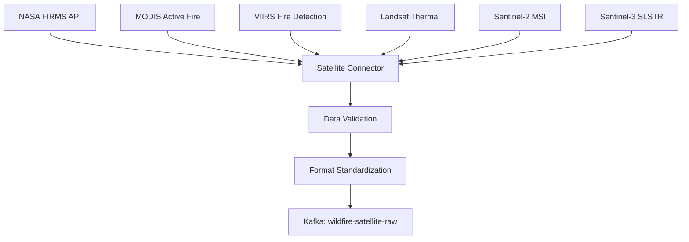

**Satellite Data Flow Details:**
- **Frequency**: Every 12-24 hours (depending on satellite)
- **Volume**: ~50,000 fire detection points/day (California)
- **Format**: CSV, JSON, GeoTIFF, NetCDF
- **Processing**: Real-time validation, coordinate transformation, quality scoring

### 2. Weather Data Sources

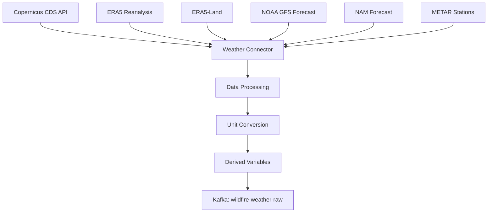

**Weather Data Flow Details:**
- **Frequency**: Hourly updates, 3-hour batches
- **Volume**: ~100MB NetCDF files per day
- **Coverage**: 0.25deg grid resolution (California)
- **Variables**: Temperature, humidity, wind, precipitation, pressure

### 3. IoT Sensor Data

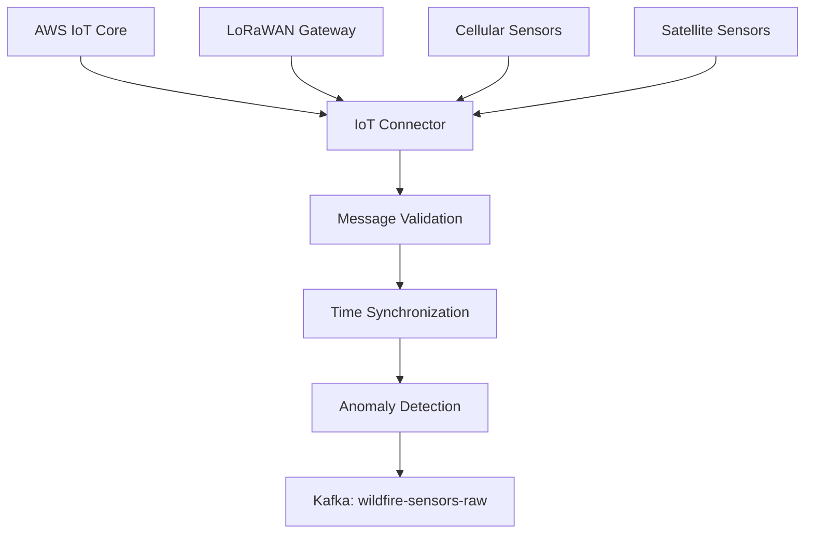

**IoT Sensor Data Flow Details:**
- **Frequency**: Real-time streaming (1-15 minute intervals)
- **Volume**: ~10,000 sensor readings/hour
- **Types**: Temperature, humidity, smoke, air quality, wind
- **Protocol**: MQTT, LoRaWAN, HTTP POST

## Data Processing Pipeline

### 1. Real-Time Stream Processing

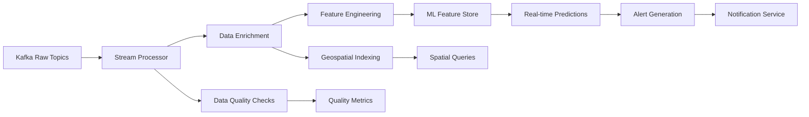

**Stream Processing Details:**
- **Technology**: Kafka Streams, Apache Flink
- **Latency**: < 100ms end-to-end
- **Throughput**: 10,000+ events/second
- **Features**: Windowing, aggregations, joins, pattern detection

### 2. Batch Processing Pipeline

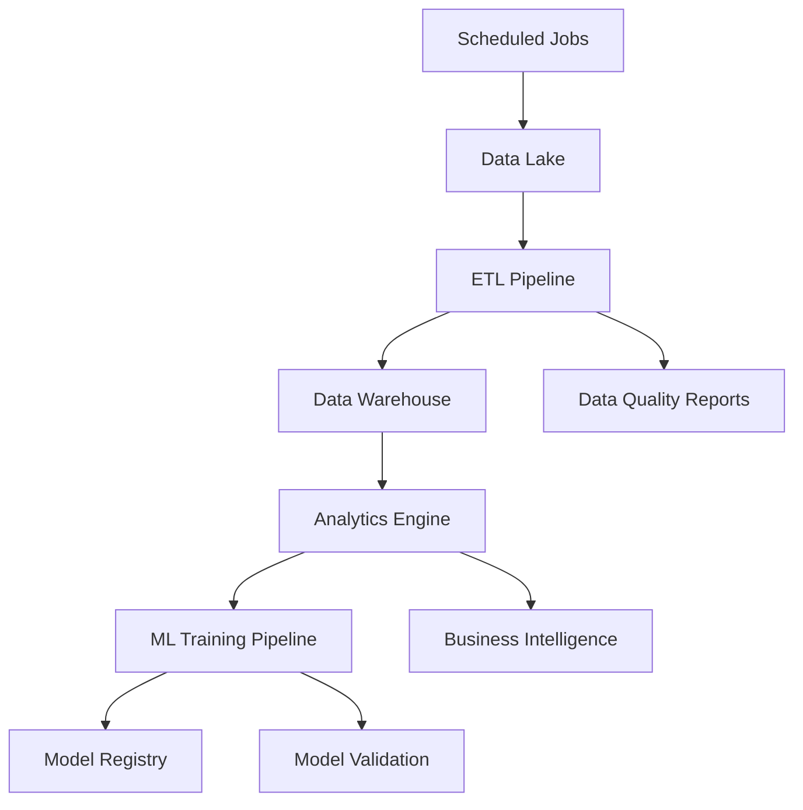

**Batch Processing Details:**
- **Technology**: Apache Airflow, Apache Spark
- **Schedule**: Hourly, daily, weekly jobs
- **Volume**: TB-scale historical data processing
- **Operations**: Aggregations, ML training, report generation

### 3. Machine Learning Pipeline

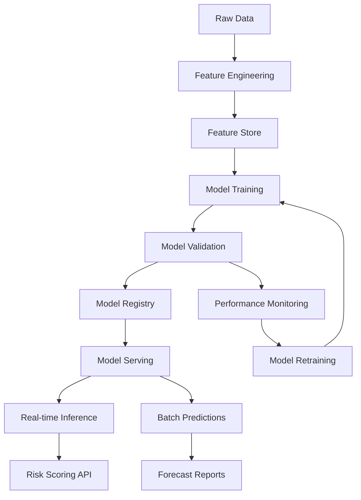

**ML Pipeline Details:**
- **Framework**: MLflow, Kubeflow
- **Models**: Fire risk classification, spread prediction, intensity forecasting
- **Features**: Weather patterns, vegetation indices, historical fire data
- **Serving**: REST API, batch scoring

## Data Storage Architecture

### 1. Multi-Tier Storage Strategy

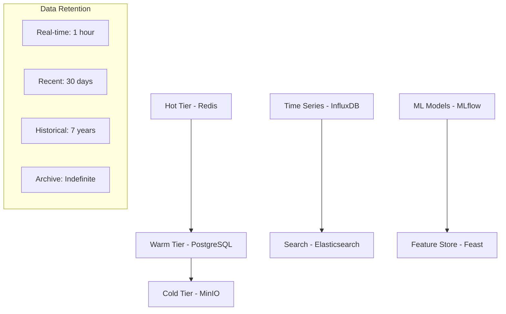

**Storage Tier Details:**

| Tier | Technology | Purpose | Retention | Performance |
|------|------------|---------|-----------|-------------|
| Hot | Redis | Caching, sessions | 1 hour | mus latency |
| Warm | PostgreSQL/InfluxDB | Active queries | 30 days | ms latency |
| Cold | MinIO S3 | Historical analysis | 7 years | seconds |
| Archive | Glacier | Compliance | Indefinite | minutes |

### 2. Data Partitioning Strategy

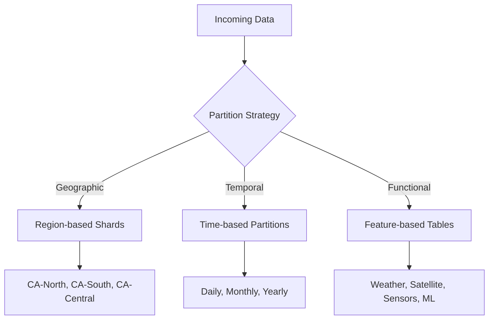

**Partitioning Benefits:**
- **Query Performance**: Faster queries with partition pruning
- **Maintenance**: Easier backup/restore operations
- **Scalability**: Independent scaling of data segments
- **Compliance**: Data residency and retention policies

## Event-Driven Architecture

### 1. Event Types & Schema

```yaml
# Fire Detection Event
fire_detection_event:
  event_id: "uuid"
  timestamp: "iso8601"
  source: "modis|viirs|landsat"
  location:
    latitude: "float"
    longitude: "float"
    elevation: "float"
  properties:
    confidence: "integer"
    brightness: "float"
    frp: "float" # Fire Radiative Power
  quality_score: "float"

# Weather Update Event
weather_update_event:
  event_id: "uuid"
  timestamp: "iso8601"
  source: "era5|gfs|nam|station"
  location:
    latitude: "float"
    longitude: "float"
  measurements:
    temperature_c: "float"
    humidity_percent: "float"
    wind_speed_ms: "float"
    wind_direction_degrees: "float"
    precipitation_mm: "float"
  forecast_horizon_hours: "integer"

# Risk Assessment Event
risk_assessment_event:
  event_id: "uuid"
  timestamp: "iso8601"
  location:
    latitude: "float"
    longitude: "float"
    radius_km: "float"
  risk_score: "float" # 0.0 - 1.0
  risk_level: "low|medium|high|extreme"
  contributing_factors:
    - weather_conditions: "float"
    - vegetation_dryness: "float"
    - historical_patterns: "float"
  confidence: "float"
  expires_at: "iso8601"
```

### 2. Event Flow Patterns

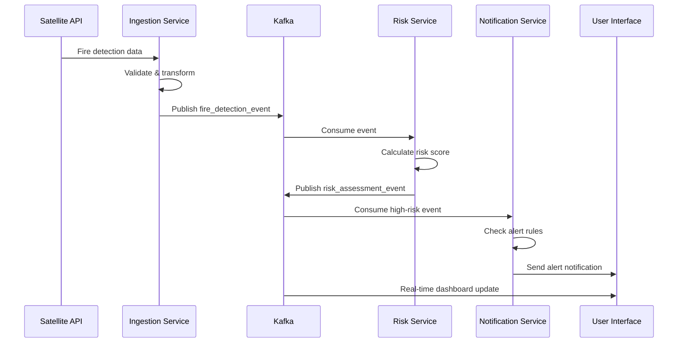

## Data Quality & Governance

### 1. Data Quality Framework

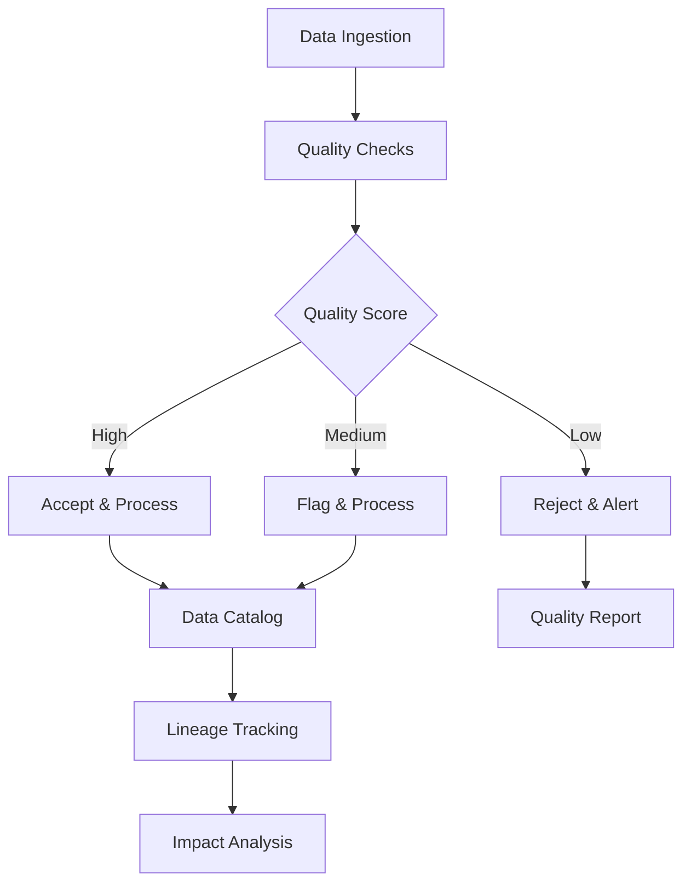

**Quality Dimensions:**
- **Completeness**: Missing field detection
- **Accuracy**: Value range validation
- **Consistency**: Cross-source validation
- **Timeliness**: Freshness monitoring
- **Uniqueness**: Duplicate detection

### 2. Data Lineage Tracking

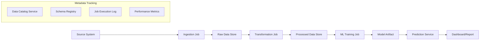

## Performance & Scalability

### 1. Throughput Requirements

| Component | Current Load | Peak Load | Target SLA |
|-----------|--------------|-----------|------------|
| Satellite Data | 1K events/min | 10K events/min | 99.5% uptime |
| Weather Data | 500 events/min | 2K events/min | 99.9% uptime |
| Sensor Data | 10K events/min | 50K events/min | 99.9% uptime |
| Risk Calculations | 100/sec | 1000/sec | <100ms latency |
| Dashboard Updates | 1K queries/min | 10K queries/min | <200ms response |

### 2. Scaling Strategies

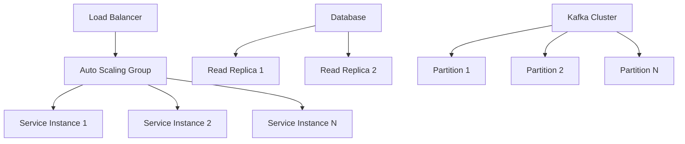

**Scaling Triggers:**
- **CPU Utilization** > 70%
- **Memory Usage** > 80%
- **Queue Depth** > 1000 messages
- **Response Time** > 500ms

### 3. Caching Strategy

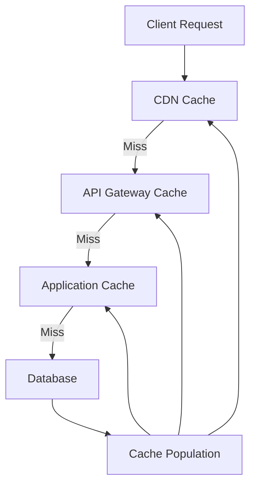

**Cache Layers:**
- **CDN**: Static assets, API responses (1 hour TTL)
- **API Gateway**: Response caching (15 minutes TTL)
- **Application**: Data objects, query results (5 minutes TTL)
- **Database**: Query result cache (1 minute TTL)

## Monitoring & Alerting

### 1. Data Pipeline Monitoring

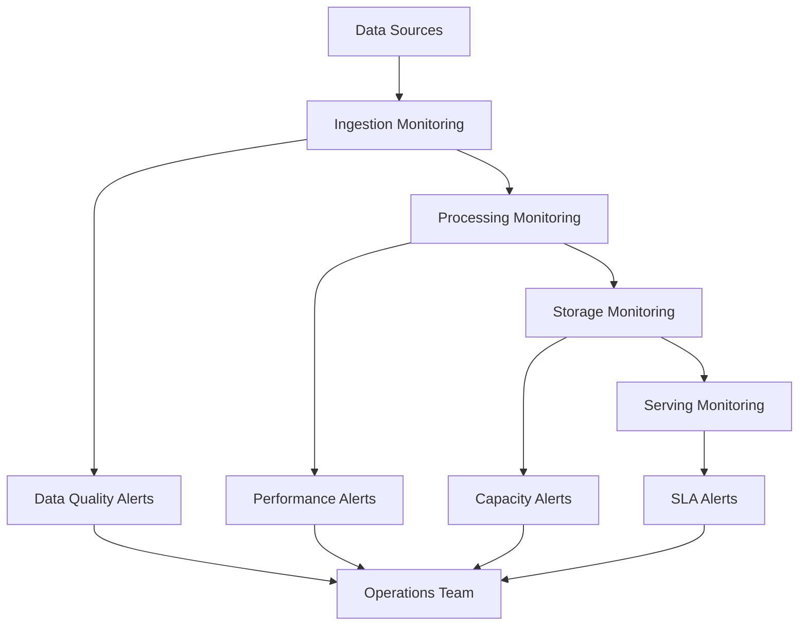

### 2. Key Performance Indicators

```yaml
Data Pipeline KPIs:
  Availability:
    - Data ingestion uptime: 99.9%
    - Processing job success rate: 99.5%
    - API availability: 99.9%
  
  Performance:
    - End-to-end latency: <5 minutes
    - Query response time: <200ms
    - Batch job completion time: <2 hours
  
  Quality:
    - Data quality score: >95%
    - Schema compliance: >99%
    - Duplicate rate: <0.1%
  
  Volume:
    - Daily data ingestion: 10GB
    - Peak event throughput: 50K/min
    - Storage growth rate: 100GB/month
```

This comprehensive data flow architecture ensures reliable, scalable, and efficient processing of wildfire-related data across the entire platform.