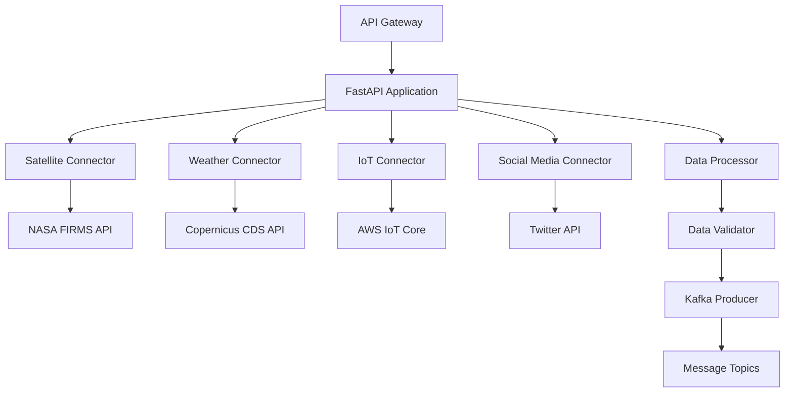
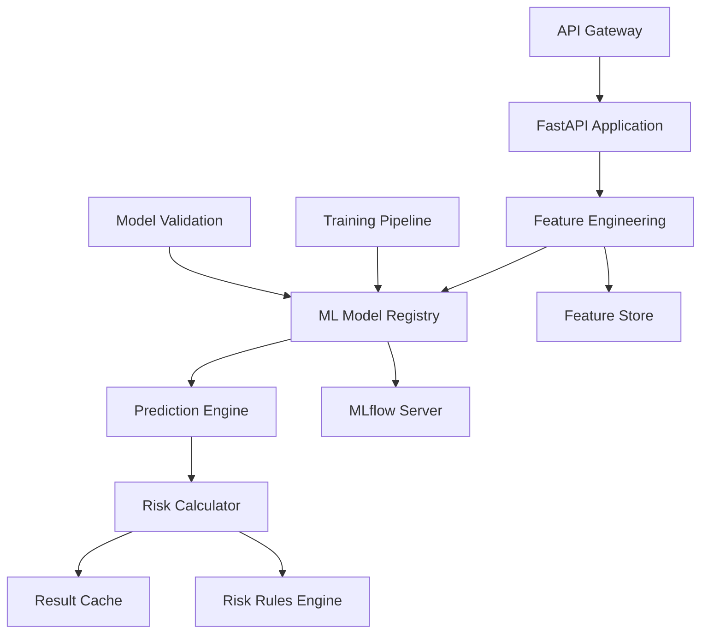
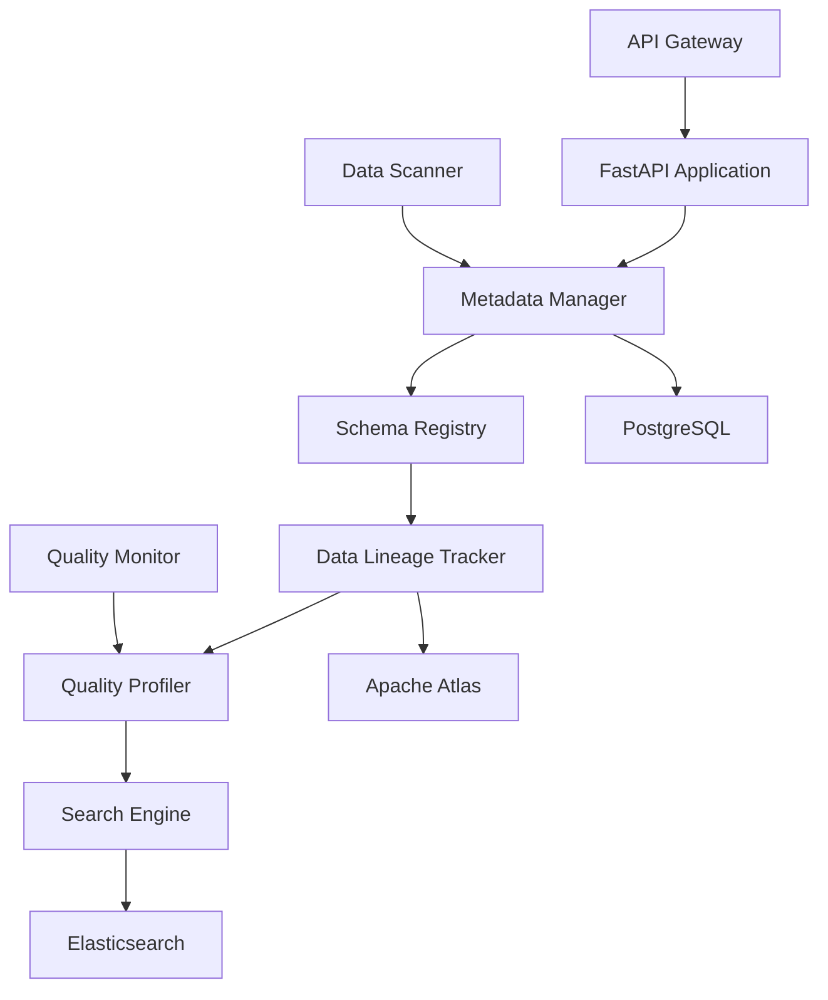
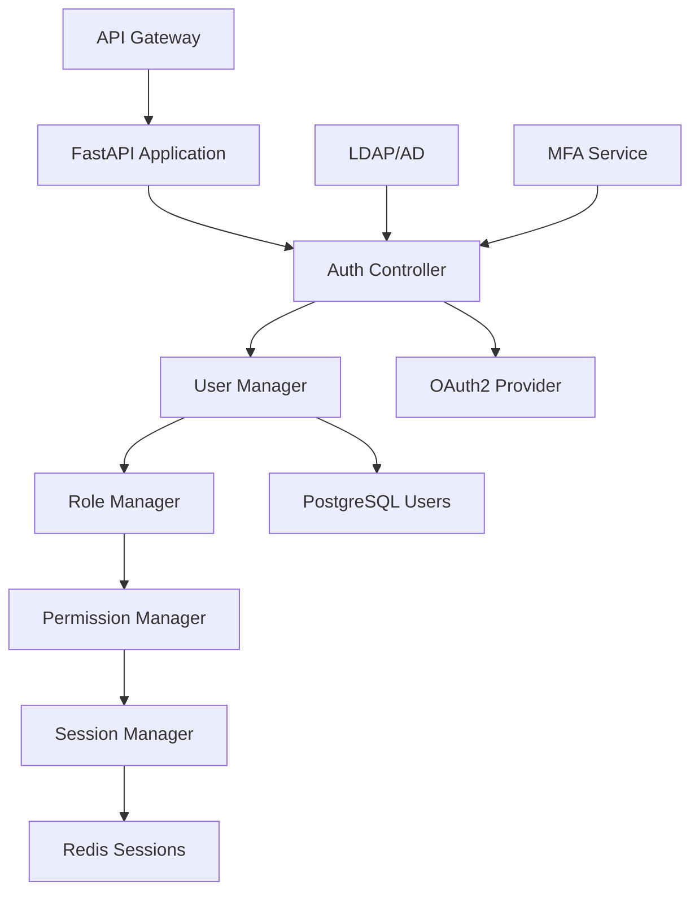
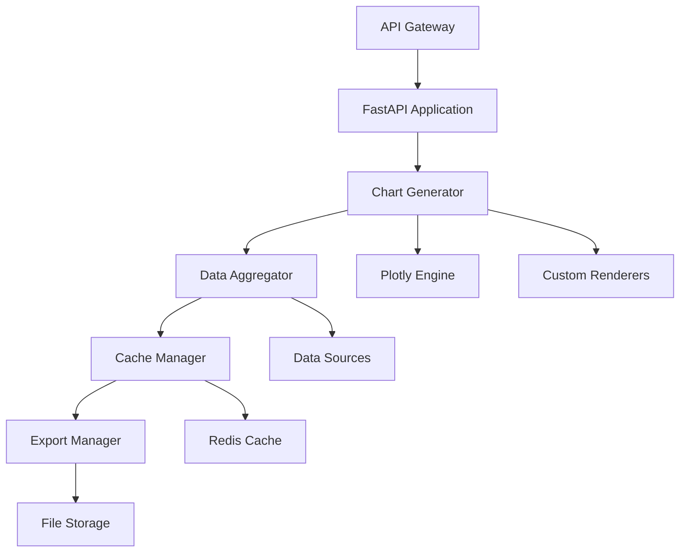
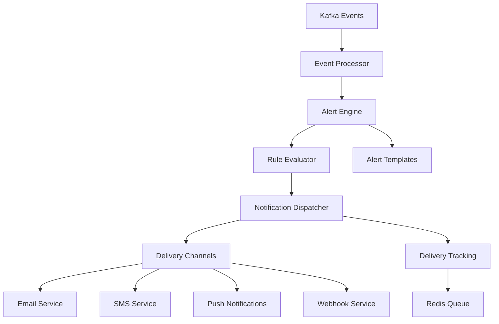
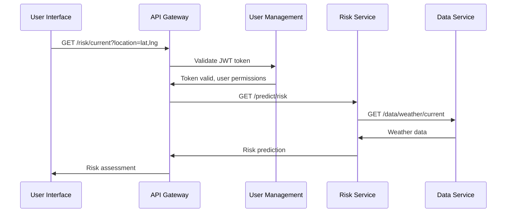
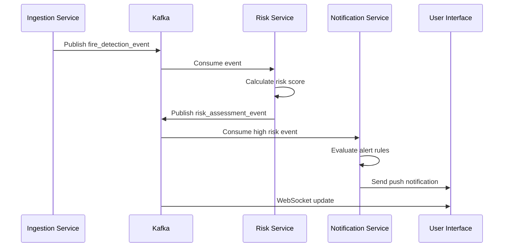

# Microservices Architecture

## Overview

The Wildfire Intelligence Platform follows a microservices architecture pattern, with each service designed around specific business capabilities and data domains. This document provides detailed specifications for each service, their interfaces, and integration patterns.

## Service Design Principles

### 1. Domain-Driven Design (DDD)
- Services are organized around business capabilities
- Clear bounded contexts with well-defined interfaces
- Domain models encapsulated within service boundaries

### 2. Service Autonomy
- Independent development and deployment cycles
- Technology stack flexibility per service
- Database per service pattern

### 3. Failure Resilience
- Circuit breaker pattern for external dependencies
- Graceful degradation and fallback mechanisms
- Distributed tracing for debugging

## Service Catalog

### 1. Data Ingestion Service

#### Service Overview
**Port**: 8002  
**Technology Stack**: Python, FastAPI, Kafka, aiohttp  
**Purpose**: Unified data ingestion hub for all external data sources

#### Service Architecture


#### Key Components

**Data Connectors**
```python
# Abstract base class for all connectors
class DataConnector:
    async def health_check() -> bool
    async def get_sources() -> List[DataSource]
    async def fetch_batch_data(config: BatchConfig) -> List[Dict]
    async def start_streaming(config: StreamingConfig) -> str
    async def stop_streaming(stream_id: str) -> bool
```

**Data Processing Pipeline**
```python
class DataProcessor:
    async def process_batch(data: List[Dict], config: ProcessingConfig) -> List[Dict]
    async def validate_schema(data: Dict, schema: Schema) -> ValidationResult
    async def transform_format(data: Dict, target_format: str) -> Dict
    async def enrich_data(data: Dict, enrichment_rules: List[Rule]) -> Dict
```

#### API Endpoints

| Method | Endpoint | Description |
|--------|----------|-------------|
| GET | `/health` | Service health check |
| GET | `/sources` | List configured data sources |
| POST | `/sources` | Add new data source |
| POST | `/ingest/batch` | Trigger batch data ingestion |
| POST | `/ingest/file` | Upload file for processing |
| POST | `/stream/start` | Start real-time streaming |
| POST | `/stream/stop/{id}` | Stop data stream |
| GET | `/stream/status` | Get streaming status |
| GET | `/metrics` | Prometheus metrics |

#### Configuration Schema
```yaml
# Data source configuration
data_sources:
  satellite:
    nasa_firms:
      api_key: "${NASA_FIRMS_API_KEY}"
      base_url: "https://firms.modaps.eosdis.nasa.gov"
      rate_limit: 1000  # requests per hour
  
  weather:
    copernicus_cds:
      api_key: "${CDS_API_KEY}"
      base_url: "https://cds.climate.copernicus.eu/api"
      max_concurrent_requests: 5

# Kafka configuration
kafka:
  bootstrap_servers: ["kafka:29092"]
  topics:
    satellite_raw: "wildfire-satellite-raw"
    weather_raw: "wildfire-weather-raw"
    sensors_raw: "wildfire-sensors-raw"
```

#### Performance Characteristics
- **Throughput**: 10,000 events/second
- **Latency**: <100ms processing time
- **Availability**: 99.9% uptime SLA
- **Scaling**: Horizontal auto-scaling based on queue depth

---

### 2. Fire Risk Service

#### Service Overview
**Port**: 8001  
**Technology Stack**: Python, FastAPI, scikit-learn, TensorFlow, MLflow  
**Purpose**: ML-powered fire risk prediction and analysis

#### Service Architecture


#### Key Components

**Feature Engineering**
```python
class FeatureEngineer:
    def extract_weather_features(self, weather_data: Dict) -> Dict
    def extract_satellite_features(self, satellite_data: Dict) -> Dict
    def extract_temporal_features(self, timestamp: datetime) -> Dict
    def extract_spatial_features(self, location: Point) -> Dict
    def combine_features(self, feature_sets: List[Dict]) -> np.ndarray
```

**ML Model Management**
```python
class ModelManager:
    def load_model(self, model_name: str, version: str) -> MLModel
    def predict(self, features: np.ndarray) -> PredictionResult
    def get_model_metadata(self, model_id: str) -> ModelMetadata
    def register_model(self, model: MLModel, metadata: Dict) -> str
```

**Risk Assessment Engine**
```python
class RiskAssessment:
    def calculate_fire_risk(self, location: Point, timestamp: datetime) -> RiskScore
    def predict_fire_spread(self, fire_location: Point, weather: Dict) -> SpreadPrediction
    def assess_evacuation_zones(self, fire_perimeter: Polygon) -> List[Zone]
```

#### API Endpoints

| Method | Endpoint | Description |
|--------|----------|-------------|
| POST | `/predict/risk` | Calculate fire risk for location |
| POST | `/predict/spread` | Predict fire spread patterns |
| POST | `/assess/evacuation` | Assess evacuation zones |
| GET | `/models` | List available ML models |
| GET | `/models/{id}` | Get model metadata |
| POST | `/models/register` | Register new model |
| GET | `/features/{location}` | Get features for location |

#### Model Specifications

**Fire Risk Classification Model**
```yaml
model_name: "fire_risk_classifier_v2"
model_type: "random_forest"
input_features:
  weather: ["temperature", "humidity", "wind_speed", "precipitation"]
  vegetation: ["ndvi", "moisture_content", "fuel_load"]
  topography: ["elevation", "slope", "aspect"]
  historical: ["fire_history", "seasonal_patterns"]
output: 
  risk_score: "float [0.0, 1.0]"
  risk_category: "enum [low, medium, high, extreme]"
performance:
  accuracy: 0.92
  precision: 0.89
  recall: 0.94
```

**Fire Spread Prediction Model**
```yaml
model_name: "fire_spread_predictor_v1"
model_type: "neural_network"
input_features:
  current_fire: ["perimeter", "intensity", "rate_of_spread"]
  weather_forecast: ["wind_vectors", "humidity_forecast", "temperature_forecast"]
  terrain: ["fuel_models", "topography", "barriers"]
output:
  spread_polygons: "List[Polygon]"  # Predicted fire perimeters
  time_steps: "List[datetime]"      # Time progression
  confidence: "float [0.0, 1.0]"
performance:
  mae_distance: "127 meters"        # Mean absolute error
  temporal_accuracy: "85%"          # Within 1 hour
```

---

### 3. Data Catalog Service

#### Service Overview
**Port**: 8003  
**Technology Stack**: Python, FastAPI, Elasticsearch, PostgreSQL, Apache Atlas  
**Purpose**: Centralized metadata management and data discovery

#### Service Architecture


#### Key Components

**Metadata Management**
```python
class MetadataManager:
    def register_dataset(self, dataset: Dataset) -> str
    def get_dataset(self, dataset_id: str) -> Dataset
    def search_datasets(self, query: SearchQuery) -> List[Dataset]
    def update_schema(self, dataset_id: str, schema: Schema) -> bool
    def track_usage(self, dataset_id: str, user_id: str) -> None
```

**Data Lineage**
```python
class LineageTracker:
    def track_transformation(self, source: str, target: str, job: str) -> None
    def get_upstream_dependencies(self, dataset_id: str) -> List[Dataset]
    def get_downstream_dependencies(self, dataset_id: str) -> List[Dataset]
    def analyze_impact(self, dataset_id: str) -> ImpactAnalysis
```

**Quality Profiling**
```python
class DataProfiler:
    def profile_dataset(self, dataset_id: str) -> DataProfile
    def calculate_quality_score(self, profile: DataProfile) -> float
    def detect_anomalies(self, dataset_id: str) -> List[Anomaly]
    def generate_quality_report(self, dataset_id: str) -> QualityReport
```

#### API Endpoints

| Method | Endpoint | Description |
|--------|----------|-------------|
| GET | `/datasets` | Search and list datasets |
| POST | `/datasets` | Register new dataset |
| GET | `/datasets/{id}` | Get dataset details |
| PUT | `/datasets/{id}` | Update dataset metadata |
| GET | `/datasets/{id}/schema` | Get dataset schema |
| GET | `/datasets/{id}/lineage` | Get data lineage |
| GET | `/datasets/{id}/quality` | Get quality metrics |
| GET | `/datasets/{id}/profile` | Get data profile |

---

### 4. User Management Service

#### Service Overview
**Port**: 8004  
**Technology Stack**: Python, FastAPI, PostgreSQL, Redis, OAuth2  
**Purpose**: Authentication, authorization, and user lifecycle management

#### Service Architecture


#### Key Components

**Authentication Manager**
```python
class AuthManager:
    def authenticate_user(self, credentials: UserCredentials) -> AuthResult
    def generate_jwt_token(self, user: User) -> JWTToken
    def validate_token(self, token: str) -> TokenValidation
    def refresh_token(self, refresh_token: str) -> JWTToken
    def logout_user(self, user_id: str) -> bool
```

**Authorization Manager**
```python
class AuthzManager:
    def check_permission(self, user_id: str, resource: str, action: str) -> bool
    def get_user_permissions(self, user_id: str) -> List[Permission]
    def assign_role(self, user_id: str, role: str) -> bool
    def create_role(self, role: Role) -> str
```

#### Role-Based Access Control

```yaml
roles:
  fire_chief:
    permissions:
      - "dashboard:view:all"
      - "alerts:manage:all"
      - "reports:generate:all"
      - "resources:allocate:all"
    description: "Senior fire department leadership"
  
  analyst:
    permissions:
      - "dashboard:view:regional"
      - "data:query:weather,satellite"
      - "reports:generate:standard"
    description: "Fire behavior analysts"
  
  scientist:
    permissions:
      - "data:query:all"
      - "models:train:all"
      - "experiments:run:all"
      - "datasets:export:all"
    description: "Research scientists and ML engineers"
  
  field_team:
    permissions:
      - "mobile:view:assigned_incidents"
      - "sensors:deploy:field"
      - "status:update:field_operations"
    description: "Field personnel and first responders"
```

#### API Endpoints

| Method | Endpoint | Description |
|--------|----------|-------------|
| POST | `/auth/login` | User authentication |
| POST | `/auth/logout` | User logout |
| POST | `/auth/refresh` | Refresh JWT token |
| GET | `/users` | List users (admin) |
| POST | `/users` | Create user account |
| GET | `/users/{id}` | Get user profile |
| PUT | `/users/{id}` | Update user profile |
| GET | `/users/{id}/permissions` | Get user permissions |
| POST | `/roles` | Create role |
| GET | `/roles` | List roles |

---

### 5. Visualization Service

#### Service Overview
**Port**: 8005  
**Technology Stack**: Python, FastAPI, Plotly, Redis  
**Purpose**: Chart generation and dashboard data preparation

#### Service Architecture


#### Key Components

**Chart Generator**
```python
class ChartGenerator:
    def create_risk_map(self, region: Polygon, date: datetime) -> MapChart
    def create_time_series(self, metric: str, time_range: TimeRange) -> TimeSeriesChart
    def create_histogram(self, data: List[float], bins: int) -> HistogramChart
    def create_heatmap(self, matrix: np.ndarray) -> HeatmapChart
```

#### API Endpoints

| Method | Endpoint | Description |
|--------|----------|-------------|
| POST | `/charts/risk-map` | Generate fire risk map |
| POST | `/charts/time-series` | Generate time series chart |
| POST | `/charts/histogram` | Generate histogram |
| POST | `/charts/correlation` | Generate correlation matrix |
| GET | `/charts/{id}` | Get cached chart |
| POST | `/export/pdf` | Export charts to PDF |
| POST | `/export/excel` | Export data to Excel |

---

### 6. Notification Service

#### Service Overview
**Port**: 8006  
**Technology Stack**: Python, FastAPI, Celery, Redis, Kafka  
**Purpose**: Alert generation and multi-channel delivery

#### Service Architecture


#### Key Components

**Alert Engine**
```python
class AlertEngine:
    def evaluate_rules(self, event: Event) -> List[Alert]
    def create_alert(self, rule: AlertRule, event: Event) -> Alert
    def escalate_alert(self, alert: Alert) -> EscalatedAlert
    def suppress_alert(self, alert: Alert) -> bool
```

**Multi-Channel Delivery**
```python
class NotificationDispatcher:
    def send_email(self, recipients: List[str], alert: Alert) -> DeliveryResult
    def send_sms(self, phone_numbers: List[str], message: str) -> DeliveryResult
    def send_push(self, device_tokens: List[str], alert: Alert) -> DeliveryResult
    def send_webhook(self, url: str, payload: Dict) -> DeliveryResult
```

#### Alert Rules Configuration

```yaml
alert_rules:
  high_fire_risk:
    condition: "risk_score > 0.8"
    severity: "high"
    channels: ["email", "sms", "push"]
    recipients:
      - role: "fire_chief"
      - role: "analyst"
    template: "high_risk_alert"
    cooldown: "15m"
  
  extreme_weather:
    condition: "wind_speed > 25 AND humidity < 20"
    severity: "critical"
    channels: ["email", "sms", "push", "webhook"]
    recipients:
      - all_users: true
    template: "extreme_weather_alert"
    escalation:
      - delay: "5m"
        channels: ["phone_call"]
```

## Service Communication Patterns

### 1. Synchronous Communication (REST)



### 2. Asynchronous Communication (Events)



### 3. Request-Response with Circuit Breaker

```python
class CircuitBreaker:
    def __init__(self, failure_threshold=5, timeout=60):
        self.failure_threshold = failure_threshold
        self.timeout = timeout
        self.failure_count = 0
        self.state = "CLOSED"  # CLOSED, OPEN, HALF_OPEN
        self.last_failure_time = None
    
    async def call(self, func, *args, **kwargs):
        if self.state == "OPEN":
            if time.time() - self.last_failure_time > self.timeout:
                self.state = "HALF_OPEN"
            else:
                raise CircuitBreakerOpenException()
        
        try:
            result = await func(*args, **kwargs)
            if self.state == "HALF_OPEN":
                self.state = "CLOSED"
                self.failure_count = 0
            return result
        except Exception as e:
            self.failure_count += 1
            if self.failure_count >= self.failure_threshold:
                self.state = "OPEN"
                self.last_failure_time = time.time()
            raise e
```

## Service Discovery & Load Balancing

### 1. Service Registry

```yaml
services:
  data-ingestion-service:
    instances:
      - id: "dis-001"
        host: "10.0.1.10"
        port: 8002
        health_check: "/health"
        weight: 100
      - id: "dis-002"
        host: "10.0.1.11"
        port: 8002
        health_check: "/health"
        weight: 100
    
  fire-risk-service:
    instances:
      - id: "frs-001"
        host: "10.0.2.10"
        port: 8001
        health_check: "/health"
        weight: 100
        metadata:
          model_version: "v2.1"
          gpu_enabled: true
```

### 2. Load Balancing Strategies

```python
class LoadBalancer:
    def __init__(self, strategy="round_robin"):
        self.strategy = strategy
        self.current_index = 0
    
    def select_instance(self, instances: List[ServiceInstance]) -> ServiceInstance:
        if self.strategy == "round_robin":
            return self._round_robin(instances)
        elif self.strategy == "weighted_random":
            return self._weighted_random(instances)
        elif self.strategy == "least_connections":
            return self._least_connections(instances)
        else:
            return random.choice(instances)
```

## Monitoring & Observability

### 1. Health Checks

```python
# Standard health check endpoint for all services
@app.get("/health")
async def health_check():
    health_status = {
        "status": "healthy",
        "timestamp": datetime.utcnow().isoformat(),
        "version": app.version,
        "dependencies": {}
    }
    
    # Check database connectivity
    try:
        await database.ping()
        health_status["dependencies"]["database"] = "healthy"
    except Exception as e:
        health_status["dependencies"]["database"] = f"unhealthy: {str(e)}"
        health_status["status"] = "degraded"
    
    # Check Kafka connectivity
    try:
        await kafka_producer.ping()
        health_status["dependencies"]["kafka"] = "healthy"
    except Exception as e:
        health_status["dependencies"]["kafka"] = f"unhealthy: {str(e)}"
        health_status["status"] = "degraded"
    
    return health_status
```

### 2. Distributed Tracing

```python
from opentelemetry import trace
from opentelemetry.instrumentation.fastapi import FastAPIInstrumentor

# Initialize tracing
tracer = trace.get_tracer(__name__)
FastAPIInstrumentor.instrument_app(app)

# Custom tracing
@app.post("/predict/risk")
async def predict_risk(request: RiskRequest):
    with tracer.start_as_current_span("predict_risk") as span:
        span.set_attribute("location.lat", request.latitude)
        span.set_attribute("location.lng", request.longitude)
        
        # Add more spans for sub-operations
        with tracer.start_as_current_span("fetch_weather_data"):
            weather_data = await fetch_weather_data(request.location)
        
        with tracer.start_as_current_span("ml_prediction"):
            prediction = await ml_model.predict(weather_data)
        
        return prediction
```

This microservices architecture provides a scalable, maintainable, and resilient foundation for the Wildfire Intelligence Platform.